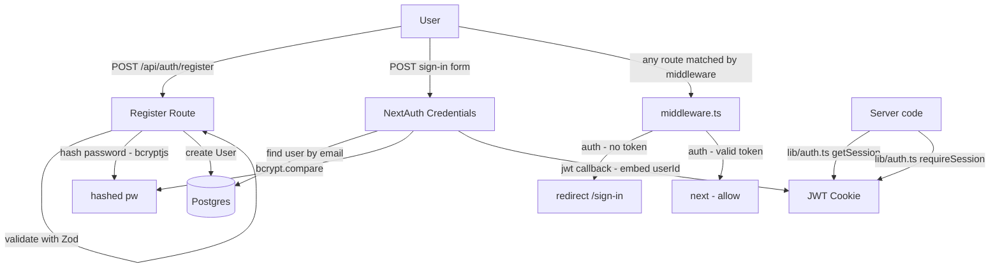

# M1 — Authentication Design

**Spec**: `.specs/features/m1-auth/spec.md`
**Status**: Draft

---

## Boundary: Auth vs Infrastructure

Auth is responsible for: session creation, JWT signing, credential validation, sign-up, sign-out, route protection via middleware, and the `lib/auth.ts` helper.

`GET /api/me` is **not** owned by auth — it belongs to Infrastructure. It uses the session produced by auth, but its purpose is to validate the full stack (auth + Prisma + Postgres). The boundary: auth ends when the session exists; infra uses it for roundtrip validation.

---

## Implementation Order

Auth depends directly on Infrastructure. This order must be respected:

```
1. Docker Compose + Postgres running           [Infrastructure]
2. Prisma schema migrated (User model exists)  [Infrastructure]
3. lib/db.ts available                         [Infrastructure]
4. auth.ts + NextAuth config                   [Auth — depends on 2, 3]
5. middleware.ts                               [Auth — depends on 4]
6. Register route + sign-in/sign-up pages      [Auth — depends on 4]
7. GET /api/me                                 [Infrastructure — depends on 4, 3]
```

Steps 4–7 cannot start before steps 1–3 are verified.

---

## Architecture Overview

NextAuth.js v5 (Auth.js) with Credentials provider (email + password). Sessions are JWT-based. Route protection via `middleware.ts` with an explicit matcher. Sign-up is a separate `POST /api/auth/register` (NextAuth doesn't handle registration).



---

## Code Reuse Analysis

### Existing Components to Leverage

| Component | Location | How to Use |
|---|---|---|
| Prisma client | `lib/db.ts` | Import `db` in `auth.ts` and register route |
| User model | `prisma/schema.prisma` | `email`, `password`, `name` fields already defined |

---

## Components

### NextAuth Configuration

- **Purpose**: Credentials provider, JWT callbacks, session shape
- **Location**: `auth.ts` (project root — NextAuth v5 convention)
- **Key config**:
  - Provider: `Credentials({ email, password })`
  - Strategy: `jwt`
  - `jwt` callback: embeds `token.id = user.id` on sign-in
  - `session` callback: maps `session.user.id = token.id`
- **Dependencies**: `lib/db.ts`, `bcryptjs`

### Session Type Augmentation

NextAuth v5's default `Session` type does not include `user.id`. It must be extended explicitly.

- **Location**: `types/next-auth.d.ts`
- **Shape**:

```typescript
import { DefaultSession } from "next-auth"

declare module "next-auth" {
  interface Session {
    user: {
      id: string
    } & DefaultSession["user"]
  }
  interface JWT {
    id: string
  }
}
```

Without this, `session.user.id` is `undefined` at the TypeScript level, causing silent runtime errors or forced type casts throughout the codebase.

### Auth Helper

- **Purpose**: Typed server-side session access — single import point for all server code
- **Location**: `lib/auth.ts`
- **Interfaces**:
  - `getSession(): Promise<Session | null>` — wraps `auth()` from `auth.ts`
  - `requireSession(): Promise<Session>` — returns session or throws `NextResponse` with `401`
- **Usage pattern**: every API route and Server Component that needs the current user imports from here — never calls `auth()` directly
- **Dependencies**: `auth.ts`

### Middleware (Route Protection)

- **Purpose**: Protect all app routes; redirect unauthenticated users to sign-in
- **Location**: `middleware.ts` (project root)
- **Pattern**: re-export `auth` from `auth.ts` as default middleware

```typescript
export { auth as middleware } from "@/auth"

export const config = {
  matcher: [
    '/((?!_next/static|_next/image|favicon\\.ico|api/auth|.*\\.(?:svg|png|jpg|jpeg|gif|webp)$).*)',
  ],
}
```

**Why explicit matcher**: Next.js middleware runs on every request by default, including `_next/static`, `_next/image`, and internal routes. Running auth on static assets is wasteful and can cause edge runtime errors. The regex excludes: static files, image optimization, favicon, and NextAuth's own `/api/auth/**` routes.

**Public paths** (explicitly allowed by the matcher exclusion or by auth logic):
- `/sign-in`
- `/sign-up`
- `/api/auth/**` (NextAuth handlers)

Auth pages redirect to `/` when a session already exists (handled in page components, not middleware).

### Register Route

- **Purpose**: Create new user (NextAuth Credentials does not handle registration)
- **Location**: `app/api/auth/register/route.ts`
- **Interfaces**:
  - `POST /api/auth/register` — body: `{ email, name?, password }` → `201 { id, email }` or error
- **Logic**:
  1. Parse + validate with Zod (`email` valid format, `password` min 8 chars)
  2. Check `db.user.findUnique({ where: { email } })` — return `409` if exists
  3. `bcrypt.hash(password, 12)`
  4. `db.user.create(...)` — return `201`
  5. Client calls `signIn('credentials', ...)` immediately after `201`
- **Dependencies**: `lib/db.ts`, `bcryptjs`, `zod`

### Sign-In Page

- **Purpose**: Authenticate existing users
- **Location**: `app/(auth)/sign-in/page.tsx`
- **Behavior**:
  - Form: email + password
  - Submit: `signIn('credentials', { email, password, redirectTo: '/' })`
  - Error: catch `CredentialsSignin` → display "Invalid email or password" (no enumeration)
  - Already authenticated: redirect to `/`

### Sign-Up Page

- **Purpose**: Register new users
- **Location**: `app/(auth)/sign-up/page.tsx`
- **Behavior**:
  - Form: name (optional), email, password
  - Submit: `POST /api/auth/register` → on `201`, call `signIn('credentials', ...)`
  - Errors: Zod field errors inline; `409` → "An account with this email already exists"
  - Already authenticated: redirect to `/`

### Route Group Structure

```
app/
├── (auth)/                    # Unauthenticated layout — minimal, centered, dark
│   ├── layout.tsx
│   ├── sign-in/
│   │   └── page.tsx
│   └── sign-up/
│       └── page.tsx
├── (app)/                     # Authenticated layout — protected by middleware
│   └── page.tsx               # Diagram Index placeholder
└── api/
    └── auth/
        ├── [...nextauth]/
        │   └── route.ts       # NextAuth GET + POST handler
        └── register/
            └── route.ts       # Custom sign-up endpoint
```

`GET /api/me` is not listed here — it belongs to the Infrastructure file structure.

---

## Data Models

No new models. Uses `User` from Infrastructure design. `password` stores the bcrypt hash.

### JWT Token Shape

```typescript
interface JWT {
  id: string      // user.id — injected in jwt callback
  email: string
  name?: string
  iat: number
  exp: number
}
```

### Session Shape (after augmentation)

```typescript
interface Session {
  user: {
    id: string    // from token.id — never from client
    email: string
    name?: string
  }
  expires: string
}
```

---

## Error Handling Strategy

| Error Scenario | Handling | User Impact |
|---|---|---|
| Invalid credentials | NextAuth `CredentialsSignin` error caught in page | "Invalid email or password" |
| Email already exists | Register route returns `409` | "An account with this email already exists" |
| Password too short | Zod rejects before DB | Field-level error on form |
| Empty fields on submit | Zod rejects before fetch | Field-level errors on form |
| DB unreachable on sign-in | NextAuth catches → generic error | "Something went wrong, try again" |
| Tampered JWT | NextAuth invalidates → middleware blocks | Redirect to sign-in |
| Unauthenticated API call | `requireSession()` returns `NextResponse` 401 | Client treats as auth error |
| Middleware on static assets | Excluded by matcher regex | No performance cost |

---

## Tech Decisions

| Decision | Choice | Rationale |
|---|---|---|
| Session strategy | JWT (not database sessions) | No sessions table, no cleanup job; acceptable for v1 single-user workspace |
| Password hashing | `bcryptjs` cost 12 | Pure JS — no native bindings; works on Vercel Edge without config |
| Credential error message | Generic for both wrong email and wrong password | Prevents email enumeration |
| Sign-up flow | Separate register route → then `signIn` | NextAuth Credentials has no built-in registration |
| Middleware matcher | Explicit regex excluding static/internal paths | Prevents auth running on assets; avoids edge runtime issues |
| Session type augmentation | `declare module "next-auth"` in `types/` | Makes `session.user.id` type-safe everywhere; no casts |
| OAuth providers | Not in v1 | Adds complexity (provider config, account linking, token refresh); post-MVP |
