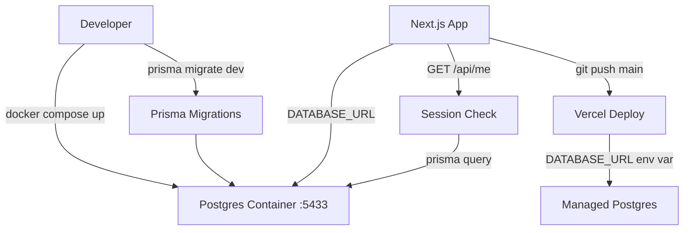

# M1 — Infrastructure Design

**Spec**: `.specs/features/m1-infrastructure/spec.md`
**Status**: Draft

---

## Implementation Order

Infrastructure steps must be completed before Auth can start. `GET /api/me` is the last step — it depends on both.

```
1. Docker Compose + Postgres running           [this feature]
2. .env.local + .env.example configured        [this feature]
3. Prisma schema defined + migrations applied  [this feature]
4. lib/db.ts singleton available               [this feature]
5. auth.ts + NextAuth configured               [Auth feature — depends on 3, 4]
6. GET /api/me                                 [this feature — depends on 4, 5]
7. Vercel deploy validated                     [this feature — depends on 5, 6]
```

Steps 5–7 are blocked until steps 1–4 are verified locally.

---

## Architecture Overview

Fresh Next.js project — no existing code to reuse. The foundation consists of four independent layers that must be operational before any feature work begins.



---

## Code Reuse Analysis

### Existing Components to Leverage

New project — no existing components. Standard Next.js App Router conventions apply.

### Integration Points

| System | Integration Method |
|---|---|
| Postgres (local) | Docker container via `DATABASE_URL` in `.env.local` |
| Postgres (prod) | Managed instance via Vercel environment variable |
| Prisma | Singleton client in `lib/db.ts`, imported by API routes |

---

## Components

### Docker Compose

- **Purpose**: Run a local Postgres instance with a single command
- **Location**: `docker-compose.yml` (project root)
- **Config**:
  - Image: `postgres:16-alpine`
  - Port: `5433:5432` (non-default to avoid conflicts with local Postgres installations)
  - Credentials: defined via env vars, matched in `.env.local`
  - Volume: named volume for data persistence between restarts

### Prisma Schema

- **Purpose**: Define and migrate the core data models
- **Location**: `prisma/schema.prisma`
- **Models**: `User`, `Diagram` (see Data Models below)
- **Generator**: `prisma-client-js`
- **Datasource**: `postgresql`, URL from `DATABASE_URL` env var

### Prisma Client Singleton

- **Purpose**: Single shared Prisma client instance across the app (prevents connection exhaustion in dev with hot reload)
- **Location**: `lib/db.ts`
- **Interfaces**:
  - `export const db: PrismaClient` — imported by all API routes and server components that need DB access
- **Pattern**: global singleton via `globalThis.__prisma` (standard Next.js + Prisma pattern)

### Environment Configuration

- **Purpose**: Separate local and production config without leaking secrets
- **Location**: `.env.example` (committed), `.env.local` (gitignored)
- **Required variables**:
  ```
  DATABASE_URL=           # Postgres connection string
  NEXTAUTH_SECRET=        # Random string for session signing
  NEXTAUTH_URL=           # App base URL (http://localhost:3000 locally)
  POSTGRES_USER=          # Docker only
  POSTGRES_PASSWORD=      # Docker only
  POSTGRES_DB=            # Docker only
  ```

### Foundation Validation Route

- **Purpose**: Proves NextAuth + Prisma + Postgres are all operational end-to-end
- **Location**: `app/api/me/route.ts`
- **Interfaces**:
  - `GET /api/me` → `{ id, email, name }` or `401`
- **Dependencies**: session from NextAuth, `db` from `lib/db.ts`
- **Logic**: extract `userId` from server session → query `User` by id → return user object

---

## Data Models

### User

```prisma
model User {
  id        String    @id @default(cuid())
  email     String    @unique
  name      String?
  password  String
  diagrams  Diagram[]
  createdAt DateTime  @default(now())
}
```

### Diagram

```prisma
model Diagram {
  id        String   @id @default(cuid())
  name      String   @default("Untitled")
  data      Json
  userId    String
  user      User     @relation(fields: [userId], references: [id], onDelete: Cascade)
  createdAt DateTime @default(now())
  updatedAt DateTime @updatedAt
}
```

**Relationships**: One User → many Diagrams. Cascade delete: removing a user removes all their diagrams.

---

## File Structure

```
/
├── docker-compose.yml
├── .env.example
├── .env.local              # gitignored
├── prisma/
│   ├── schema.prisma
│   └── migrations/
└── lib/
    └── db.ts               # Prisma client singleton
app/
└── api/
    └── me/
        └── route.ts        # GET /api/me
```

---

## Error Handling Strategy

| Error Scenario | Handling | User Impact |
|---|---|---|
| `DATABASE_URL` missing | Prisma throws on import — app fails to start | Clear startup error in terminal |
| Docker port conflict | Container fails to start with port error | Dev sees error in `docker compose up` output |
| Migration failure | Prisma rolls back — DB unchanged | Dev sees migration error, no partial state |
| `GET /api/me` unauthenticated | Route returns `401` | Expected — used to validate auth is working |

---

## Tech Decisions

| Decision | Choice | Rationale |
|---|---|---|
| Docker port | `5433` (not default `5432`) | Avoids conflict with locally installed Postgres instances |
| Prisma client pattern | Global singleton via `globalThis` | Prevents hot-reload from exhausting DB connections in dev |
| Cascade delete on Diagram | `onDelete: Cascade` | Diagrams are owned by users — orphaned diagrams have no value |
| `data` field type | `Json` | Excalidraw serializes to JSON; no need to decompose the structure at DB level |
