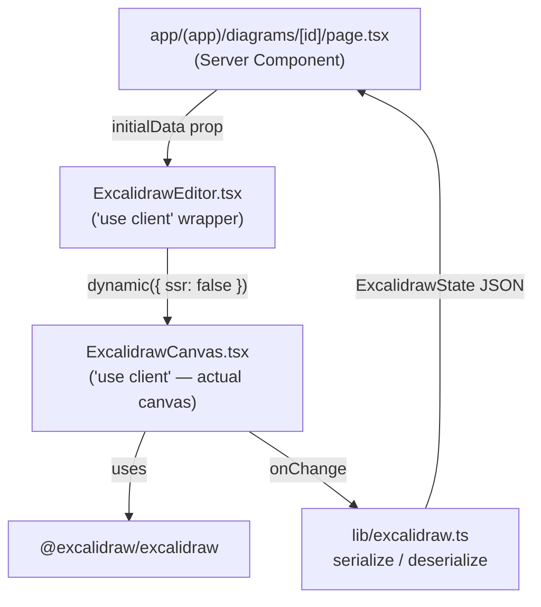

# M2a — Editor Integration Design

**Spec**: `.specs/features/m2a-editor-integration/spec.md`
**Status**: Draft

---

## Core Constraint: Excalidraw Is Client-Only

`@excalidraw/excalidraw` uses browser APIs (`window`, `document`, `ResizeObserver`, canvas) in module scope. It cannot be imported in a Server Component or rendered on the server. The integration boundary is:

- Server Components: fetch data, pass it as props — never import Excalidraw
- Client Components: own the canvas, receive data as props, call `dynamic()` with `{ ssr: false }`

This constraint drives the entire component architecture below.

---

## Architecture Overview



Two-layer component split is required because `next/dynamic` with `ssr: false` must be called from a Client Component file — not a Server Component.

---

## Component Map

### `lib/excalidraw.ts` — Serialization Utilities

- **Purpose**: Typed serialize/deserialize helpers; single source of truth for the data contract
- **Location**: `lib/excalidraw.ts`
- **Exports**:

```typescript
export type ExcalidrawState = {
  elements: readonly ExcalidrawElement[]
  appState: Partial<AppState>
  files: BinaryFiles
}

export const EMPTY_DIAGRAM: ExcalidrawState = {
  elements: [],
  appState: {},
  files: {},
}

export function serializeCanvas(
  elements: readonly ExcalidrawElement[],
  appState: Partial<AppState>,
  files: BinaryFiles
): ExcalidrawState

export function deserializeCanvas(data: unknown): ExcalidrawState
// guards against null/malformed JSON; returns EMPTY_DIAGRAM as fallback
```

- **Dependencies**: `@excalidraw/excalidraw` types only (no runtime import — types are tree-shaken)
- **Why here**: API routes, the editor page, and the canvas component all share this type. Centralizing avoids drift.

---

### `components/excalidraw/ExcalidrawCanvas.tsx` — Canvas Component

- **Purpose**: Renders Excalidraw, receives `initialData`, calls `onChange` on every change
- **Location**: `components/excalidraw/ExcalidrawCanvas.tsx`
- **Directive**: `"use client"`
- **Props**:

```typescript
type Props = {
  initialData: ExcalidrawState
  onChange?: (state: ExcalidrawState) => void
}
```

- **Key behaviors**:
  - Renders `<Excalidraw initialData={initialData} onChange={...} />` filling the viewport
  - `onChange` receives `(elements, appState, files)` from Excalidraw and calls `serializeCanvas` before forwarding — callers always receive an `ExcalidrawState`, never raw Excalidraw internals
  - Does NOT fetch or save — purely a controlled display + event component
- **Dependencies**: `@excalidraw/excalidraw`, `lib/excalidraw.ts`

---

### `components/excalidraw/ExcalidrawEditor.tsx` — Dynamic Import Wrapper

- **Purpose**: Prevents SSR of `ExcalidrawCanvas` via `next/dynamic`
- **Location**: `components/excalidraw/ExcalidrawEditor.tsx`
- **Directive**: `"use client"`
- **Pattern**:

```typescript
"use client"
import dynamic from "next/dynamic"
import type { ExcalidrawState } from "@/lib/excalidraw"

const ExcalidrawCanvas = dynamic(
  () => import("./ExcalidrawCanvas"),
  {
    ssr: false,
    loading: () => <div className="..." />, // full-screen skeleton
  }
)

export function ExcalidrawEditor(props: { initialData: ExcalidrawState; onChange?: ... }) {
  return <ExcalidrawCanvas {...props} />
}
```

- **Why two files**: `dynamic()` must be called in a file marked `"use client"`. If we put the canvas and its dynamic wrapper in the same file, the static import of `@excalidraw/excalidraw` at the top would still run on the server. Splitting ensures the problematic import lives only in `ExcalidrawCanvas`, which is never imported directly by server code.

---

### `app/(app)/diagrams/[id]/page.tsx` — Editor Page

- **Purpose**: Server Component that owns the route, passes data (mock in M2a, real in M2b)
- **Location**: `app/(app)/diagrams/[id]/page.tsx`
- **Pattern** (M2a version — mock data):

```typescript
import { ExcalidrawEditor } from "@/components/excalidraw/ExcalidrawEditor"
import { MOCK_DIAGRAM, EMPTY_DIAGRAM } from "@/lib/excalidraw"

export default function DiagramPage({ params }: { params: { id: string } }) {
  // M2a: always use mock data — no backend call
  const initialData = MOCK_DIAGRAM

  return (
    <main className="h-screen w-screen">
      <ExcalidrawEditor initialData={initialData} />
    </main>
  )
}
```

- In M2b, this becomes async and calls `requireSession()` + `getDiagramById()` to fetch real data
- **Dependencies**: `ExcalidrawEditor`, `lib/excalidraw.ts`

---

## Route Structure

```
app/
└── (app)/
    └── diagrams/
        └── [id]/
            └── page.tsx      # Editor page (Server Component)

components/
└── excalidraw/
    ├── ExcalidrawEditor.tsx   # dynamic() wrapper ("use client")
    └── ExcalidrawCanvas.tsx   # actual Excalidraw mount ("use client")

lib/
└── excalidraw.ts              # ExcalidrawState type, serialize, deserialize, EMPTY_DIAGRAM
```

---

## Data Contract

The `Diagram.data` column (type `Json` in Prisma) stores `ExcalidrawState` directly — no envelope, no transformation:

```json
{
  "elements": [...],
  "appState": { "viewBackgroundColor": "#ffffff", ... },
  "files": {}
}
```

`deserializeCanvas(diagram.data)` converts `Json` → `ExcalidrawState`. `serializeCanvas(...)` converts the reverse. The API layer is the only place this conversion happens — the canvas component and the page never deal with raw `Json`.

---

## Mock Data

For M2a validation, a static mock is defined in `lib/excalidraw.ts`:

```typescript
export const MOCK_DIAGRAM: ExcalidrawState = {
  elements: [
    // A rectangle at the center of the canvas
    {
      type: "rectangle",
      id: "mock-rect-1",
      x: 100, y: 100, width: 200, height: 120,
      strokeColor: "#1971c2", backgroundColor: "#d0ebff",
      // ... all required Excalidraw element fields
    }
  ],
  appState: { viewBackgroundColor: "#ffffff" },
  files: {},
}
```

This serves as the deserialization test fixture — if the mock renders correctly, the data contract is valid.

---

## Tech Decisions

| Decision | Choice | Rationale |
|---|---|---|
| Dynamic import pattern | Two-file split (canvas + wrapper) | Avoids module-scope browser API execution on server |
| `onChange` output type | `ExcalidrawState` (not raw Excalidraw types) | Decouples callers from Excalidraw internals; swap-friendly |
| `deserializeCanvas` fallback | Returns `EMPTY_DIAGRAM` on invalid input | Safe default; never throws during page load |
| Mock data location | `lib/excalidraw.ts` alongside type | Single import point; mock is the canonical example of a valid `ExcalidrawState` |
| Editor route | `/diagrams/[id]` from M2a | Avoids dead code; same route used in M2b with real data |
| Page layout | `h-screen w-screen` on `<main>` | Canvas should fill the viewport — no scrollbars, no chrome |
