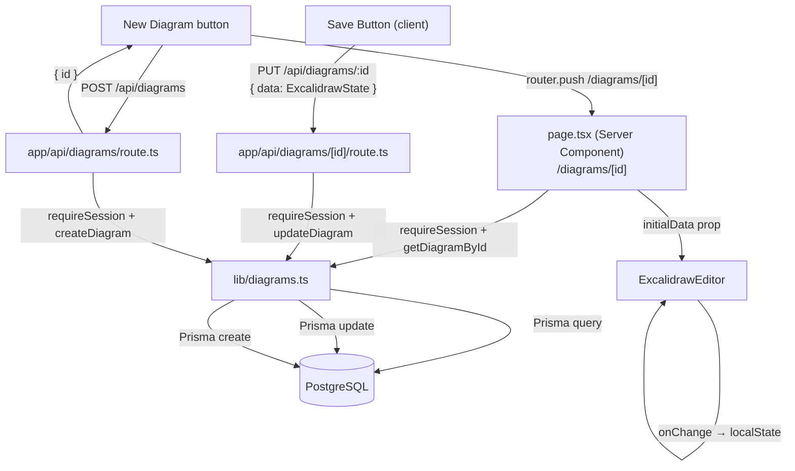

# M2b — Persistence (Manual Save) Design

**Spec**: `.specs/features/m2b-persistence/spec.md`
**Status**: Draft

---

## Architecture Overview

M2b adds a full CRUD API for diagrams and wires the editor page to the backend. The data flow has two directions:

- **Load**: Server Component (`page.tsx`) → `getDiagramById()` → Prisma → `ExcalidrawEditor` (prop)
- **Save**: `ExcalidrawCanvas.onChange` → Save button click → `PUT /api/diagrams/:id` → Prisma



---

## Ownership Enforcement Pattern

All routes follow the same three-step pattern — no exceptions:

```typescript
// 1. Session (userId from server — never from client)
const session = await requireSession() // throws 401 if missing

// 2. Ownership query (via lib/diagrams.ts — always filters by userId)
const diagram = await getDiagramById(params.id, session.user.id)

// 3. 403 if not found by that userId (covers both "not found" and "wrong owner")
if (!diagram) return NextResponse.json({ error: "Forbidden" }, { status: 403 })
```

`lib/diagrams.ts` always receives `userId` as a parameter and always includes it in the Prisma `where` clause — never trusts an ID alone.

---

## Components

### `lib/diagrams.ts` — Diagram Service

- **Purpose**: All Prisma queries for diagrams — single source of truth for DB access; ownership always baked in
- **Location**: `lib/diagrams.ts`
- **Exports**:

```typescript
export type DiagramSummary = {
  id: string
  name: string
  updatedAt: Date
}

export type DiagramDetail = DiagramSummary & {
  data: ExcalidrawState
}

export async function createDiagram(
  userId: string,
  name?: string,
  data?: ExcalidrawState
): Promise<DiagramDetail>

export async function getDiagramById(
  id: string,
  userId: string
): Promise<DiagramDetail | null>
// Returns null when not found OR when userId doesn't match — callers map null → 403

export async function listDiagrams(userId: string): Promise<DiagramSummary[]>
// Selects id, name, updatedAt — excludes data field

export async function updateDiagram(
  id: string,
  userId: string,
  patch: { name?: string; data?: ExcalidrawState }
): Promise<DiagramDetail | null>
// Returns null when not found or not owner
```

- **Dependencies**: `lib/db.ts`, `lib/excalidraw.ts` (for `ExcalidrawState` type + `deserializeCanvas`)
- **Prisma `data` field handling**: Prisma returns `Json` — `getDiagramById` and `updateDiagram` call `deserializeCanvas(raw.data)` before returning so callers always receive typed `ExcalidrawState`, never raw `Json`

---

### `app/api/diagrams/route.ts` — Collection Routes

- **Purpose**: Handle `POST /api/diagrams` (create) and `GET /api/diagrams` (list)
- **Location**: `app/api/diagrams/route.ts`

**POST handler**:
```
1. requireSession() → userId
2. Parse body with Zod: { name?: string, data?: ExcalidrawState } — both optional
3. createDiagram(userId, name, data)
4. Return 201 with full DiagramDetail
```

**GET handler**:
```
1. requireSession() → userId
2. listDiagrams(userId)
3. Return 200 with DiagramSummary[] (no data field)
```

- **Zod schema**:

```typescript
const CreateDiagramSchema = z.object({
  name: z.string().min(1).max(255).optional(),
  data: z.object({
    elements: z.array(z.any()),
    appState: z.record(z.any()).optional(),
    files: z.record(z.any()).optional(),
  }).optional(),
})
```

- **Dependencies**: `lib/auth.ts`, `lib/diagrams.ts`, `zod`

---

### `app/api/diagrams/[id]/route.ts` — Member Routes

- **Purpose**: Handle `GET /api/diagrams/:id` (fetch) and `PUT /api/diagrams/:id` (update)
- **Location**: `app/api/diagrams/[id]/route.ts`

**GET handler**:
```
1. requireSession() → userId
2. getDiagramById(params.id, userId)
3. null → 403; found → 200 with DiagramDetail
```

**PUT handler**:
```
1. requireSession() → userId
2. Parse body with Zod: { name?: string, data?: ExcalidrawState } — at least one required
3. updateDiagram(params.id, userId, patch)
4. null → 403; updated → 200 with DiagramDetail
```

- **Zod schema**:

```typescript
const UpdateDiagramSchema = z.object({
  name: z.string().min(1).max(255).optional(),
  data: z.object({
    elements: z.array(z.any()),
    appState: z.record(z.any()).optional(),
    files: z.record(z.any()).optional(),
  }).optional(),
}).refine(body => body.name !== undefined || body.data !== undefined, {
  message: "At least one of name or data is required",
})
```

- **Dependencies**: `lib/auth.ts`, `lib/diagrams.ts`, `zod`

---

### `app/(app)/diagrams/[id]/page.tsx` — Editor Page (Updated)

- **Purpose**: Server Component that fetches the real diagram and passes it to the editor; was mock data in M2a
- **Pattern** (M2b version):

```typescript
import { requireSession } from "@/lib/auth"
import { getDiagramById } from "@/lib/diagrams"
import { ExcalidrawEditor } from "@/components/excalidraw/ExcalidrawEditor"
import { notFound } from "next/navigation"

export default async function DiagramPage({ params }: { params: { id: string } }) {
  const session = await requireSession()
  const diagram = await getDiagramById(params.id, session.user.id)

  if (!diagram) notFound() // 404 page — not leaking ownership info

  return (
    <main className="h-screen w-screen flex flex-col">
      <EditorHeader name={diagram.name} diagramId={diagram.id} />
      <ExcalidrawEditor initialData={diagram.data} diagramId={diagram.id} />
    </main>
  )
}
```

- **Note on 403 vs 404**: The middleware already ensures authentication. For an authenticated user hitting someone else's diagram, `notFound()` is acceptable (security-by-obscurity is fine here — no sensitive enumeration risk for diagram IDs since they're CUIDs).

---

### `ExcalidrawEditor` — Save Button Integration

`ExcalidrawEditor.tsx` is updated to accept a `diagramId` prop and expose a manual Save button:

```typescript
type Props = {
  initialData: ExcalidrawState
  diagramId: string
}
```

**Save flow** (inside `ExcalidrawCanvas.tsx`):
1. `onChange` keeps `localState` in `useRef` (not `useState` — avoids re-renders on every stroke)
2. Save button click reads from `localState` ref, sends `PUT /api/diagrams/:id`
3. Button is disabled during in-flight request
4. On success: show "Saved" feedback; on failure: show error

```typescript
const localStateRef = useRef<ExcalidrawState>(initialData)

const handleChange = useCallback(
  (elements, appState, files) => {
    localStateRef.current = serializeCanvas(elements, appState, files)
    if (onChange) onChange(localStateRef.current)
  },
  [onChange]
)

const handleSave = async () => {
  setSaveStatus("saving")
  try {
    await fetch(`/api/diagrams/${diagramId}`, {
      method: "PUT",
      headers: { "Content-Type": "application/json" },
      body: JSON.stringify({ data: localStateRef.current }),
    })
    setSaveStatus("saved")
  } catch {
    setSaveStatus("error")
  }
}
```

`useRef` for canvas state is intentional: Excalidraw's `onChange` fires on every pointer move — `useState` would cause constant re-renders and degrade canvas performance.

---

## Route Structure

```
app/
├── (app)/
│   └── diagrams/
│       └── [id]/
│           └── page.tsx              # Updated: async, fetches real diagram
└── api/
    └── diagrams/
        ├── route.ts                  # POST + GET (list)
        └── [id]/
            └── route.ts             # GET + PUT

lib/
├── diagrams.ts                       # New: Prisma helpers (create, get, list, update)
└── excalidraw.ts                     # Unchanged (types + serialize/deserialize)

components/
└── excalidraw/
    ├── ExcalidrawEditor.tsx          # Updated: accepts diagramId, renders Save button
    └── ExcalidrawCanvas.tsx         # Updated: localStateRef, handleSave
```

---

## Data Flow: Save

```
User clicks Save
  → ExcalidrawCanvas.handleSave()
  → reads localStateRef.current (ExcalidrawState)
  → PUT /api/diagrams/:id { data: ExcalidrawState }
  → updateDiagram(id, userId, { data })
    → Prisma: UPDATE diagram SET data = $1, updatedAt = now() WHERE id = $2 AND userId = $3
  → 200 { id, name, data, updatedAt }
  → setSaveStatus("saved")
```

## Data Flow: Load

```
User navigates to /diagrams/:id
  → page.tsx (Server Component)
  → requireSession() → userId
  → getDiagramById(id, userId)
    → Prisma: SELECT * FROM diagram WHERE id = $1 AND userId = $2
    → deserializeCanvas(raw.data) → ExcalidrawState
  → <ExcalidrawEditor initialData={diagram.data} diagramId={id} />
  → ExcalidrawCanvas renders with initialData
```

---

## Error Handling

| Scenario | API Response | UI Behavior |
|---|---|---|
| Unauthenticated request | 401 | Middleware redirects to sign-in before reaching route |
| Diagram not found | 403 | `notFound()` in page → Next.js 404 page |
| Wrong owner | 403 | Same — `getDiagramById` returns null for both cases |
| Invalid PUT body | 400 | Error message in response; Save button re-enables |
| DB unreachable | 503 | Save button shows error state |
| Network timeout on save | (fetch throws) | Caught in handleSave → setSaveStatus("error") |

---

## Tech Decisions

| Decision | Choice | Rationale |
|---|---|---|
| Canvas state storage | `useRef` (not `useState`) | Excalidraw's `onChange` fires on every pointer move; `useState` causes constant re-renders |
| Ownership query pattern | Always pass `userId` to `lib/diagrams.ts` | Ownership is never an afterthought; it's in the query signature |
| null → 403 for wrong owner | Single behavior for not-found and wrong-owner | Prevents enumeration; simpler branching in route handlers |
| `data` excluded from list | `SELECT id, name, updatedAt` | List payload stays small regardless of diagram complexity |
| Zod validation on PUT | Require at least one of `name` or `data` | Prevents empty PUTs that would still hit the DB |
| `deserializeCanvas` in `lib/diagrams.ts` | Yes — happens at query layer | Routes and pages always receive typed `ExcalidrawState`, never `Json` |
