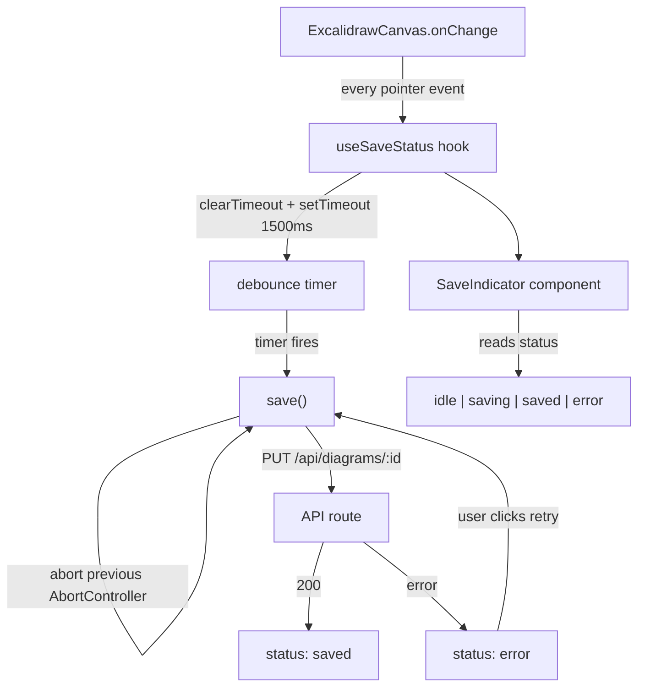

# M2c — Autosave & UX Refinement Design

**Spec**: `.specs/features/m2c-autosave/spec.md`
**Status**: Draft

---

## Architecture Overview

Autosave replaces the manual save button trigger with a debounce-driven one. The save execution path (`PUT /api/diagrams/:id`) is the same as M2b — only the trigger changes. A save state machine drives the UI indicator.



---

## Save State Machine

```
         onChange                timer fires          success
 idle ──────────────► pending ──────────────► saving ──────────► saved ──► idle (after 2s)
                         ▲                      │
                         │ (new onChange)        │ error
                         └──────────────────────┼─────────────► error
                                                │
                                            retry click
```

Four states, five transitions. The machine lives entirely inside `useSaveStatus` — no state leaks into the canvas component.

```typescript
type SaveStatus = "idle" | "pending" | "saving" | "saved" | "error"
```

---

## Components

### `hooks/useSaveStatus.ts` — Core Autosave Hook

- **Purpose**: Debounce logic, AbortController management, fetch execution, status state
- **Location**: `hooks/useSaveStatus.ts`
- **Interface**:

```typescript
type UseSaveStatusOptions = {
  diagramId: string
  debounceMs?: number // default: 1500
}

type UseSaveStatusResult = {
  status: SaveStatus
  schedulesSave: (state: ExcalidrawState) => void // call from onChange
  retry: () => void
}

export function useSaveStatus(options: UseSaveStatusOptions): UseSaveStatusResult
```

- **Internal implementation sketch**:

```typescript
export function useSaveStatus({ diagramId, debounceMs = 1500 }: UseSaveStatusOptions) {
  const [status, setStatus] = useState<SaveStatus>("idle")
  const pendingStateRef = useRef<ExcalidrawState | null>(null)
  const timerRef = useRef<ReturnType<typeof setTimeout> | null>(null)
  const abortRef = useRef<AbortController | null>(null)

  const save = useCallback(async (state: ExcalidrawState) => {
    // Cancel any in-flight request
    abortRef.current?.abort()
    const controller = new AbortController()
    abortRef.current = controller

    setStatus("saving")
    try {
      const res = await fetch(`/api/diagrams/${diagramId}`, {
        method: "PUT",
        headers: { "Content-Type": "application/json" },
        body: JSON.stringify({ data: state }),
        signal: controller.signal,
      })
      if (!res.ok) throw new Error(`HTTP ${res.status}`)
      setStatus("saved")
      // Auto-clear "saved" label after 2s
      setTimeout(() => setStatus("idle"), 2000)
    } catch (err) {
      if ((err as Error).name === "AbortError") return // aborted — not a real failure
      setStatus("error")
    }
  }, [diagramId])

  const schedulesSave = useCallback((state: ExcalidrawState) => {
    pendingStateRef.current = state
    setStatus("pending")
    if (timerRef.current) clearTimeout(timerRef.current)
    timerRef.current = setTimeout(() => {
      if (pendingStateRef.current) save(pendingStateRef.current)
    }, debounceMs)
  }, [save, debounceMs])

  const retry = useCallback(() => {
    if (pendingStateRef.current) save(pendingStateRef.current)
  }, [save])

  // Cleanup on unmount — prevents saves on unmounted component
  useEffect(() => {
    return () => {
      if (timerRef.current) clearTimeout(timerRef.current)
      abortRef.current?.abort()
    }
  }, [])

  return { status, schedulesSave, retry }
}
```

- **Dependencies**: React (`useState`, `useRef`, `useCallback`, `useEffect`), `lib/excalidraw.ts`

---

### `components/excalidraw/SaveIndicator.tsx` — Status UI

- **Purpose**: Ambient save feedback — shows saving/saved/error state non-intrusively
- **Location**: `components/excalidraw/SaveIndicator.tsx`
- **Props**:

```typescript
type Props = {
  status: SaveStatus
  onRetry: () => void
}
```

- **Rendering rules**:

| Status | Display |
|---|---|
| `idle` | Nothing (no DOM) |
| `pending` | Nothing — debounce hasn't fired yet, no visual noise |
| `saving` | "Saving…" (muted text, top-right corner) |
| `saved` | "Saved ✓" (auto-disappears after 2s — handled by hook) |
| `error` | "Save failed · Retry" (persistent, with clickable "Retry" triggering `onRetry`) |

- **Dependencies**: React, `SaveStatus` type from `hooks/useSaveStatus.ts`

---

### `ExcalidrawCanvas.tsx` — Updated Integration

M2b added a manual save button with its own state. M2c replaces that pattern:

**Remove**:
- `saveStatus` state and `handleSave` function
- Save button

**Add**:
- `const { status, schedulesSave, retry } = useSaveStatus({ diagramId })`
- `onChange` calls `schedulesSave(state)` instead of just `localStateRef.current = state`
- `<SaveIndicator status={status} onRetry={retry} />` rendered in the editor chrome

```typescript
// Before (M2b):
const handleChange = (elements, appState, files) => {
  localStateRef.current = serializeCanvas(elements, appState, files)
}

// After (M2c):
const handleChange = (elements, appState, files) => {
  const state = serializeCanvas(elements, appState, files)
  localStateRef.current = state
  schedulesSave(state) // triggers debounce
}
```

The `localStateRef` is kept for the `retry` path — on retry, the hook uses `pendingStateRef` internally (which always holds the latest state), so the ref in the canvas is just for other potential consumers (e.g., M3 rename feature).

---

### Tab-Close Flush

Handled with a `beforeunload` event listener in `ExcalidrawCanvas`:

```typescript
useEffect(() => {
  const handleBeforeUnload = () => {
    if (status === "pending" && pendingStateRef.current) {
      navigator.sendBeacon(
        `/api/diagrams/${diagramId}`,
        JSON.stringify({ data: pendingStateRef.current })
      )
    }
  }
  window.addEventListener("beforeunload", handleBeforeUnload)
  return () => window.removeEventListener("beforeunload", handleBeforeUnload)
}, [status, diagramId])
```

`sendBeacon` fires and forgets — the browser may complete it even after the page unloads. No response handling needed. Falls back to "last 1-2 seconds may be lost" if the OS kills the tab before the beacon completes — this is documented in spec as acceptable.

**Note**: `sendBeacon` sends `application/x-www-form-urlencoded` by default. Passing a `Blob` with `type: "application/json"` sets the correct Content-Type:
```typescript
navigator.sendBeacon(url, new Blob([JSON.stringify(data)], { type: "application/json" }))
```

The API route (`PUT /api/diagrams/:id`) must already handle `application/json` — no changes needed on the backend.

---

## Route Structure

```
hooks/
└── useSaveStatus.ts                  # New: debounce + AbortController + state machine

components/
└── excalidraw/
    ├── ExcalidrawCanvas.tsx          # Updated: schedulesSave in onChange, beforeunload
    ├── ExcalidrawEditor.tsx          # Unchanged
    └── SaveIndicator.tsx             # New: status label + retry button
```

No new API routes — M2c is entirely client-side orchestration on top of M2b's `PUT /api/diagrams/:id`.

---

## Edge Cases

| Scenario | Handling |
|---|---|
| Component unmounts mid-debounce | `useEffect` cleanup: `clearTimeout` + `abortController.abort()` |
| `onChange` fires during active save | New debounce scheduled; `pendingStateRef` updated; previous save aborted on next fire |
| Save fails with 401 | `setStatus("error")` — user sees "Save failed"; session expiry handled at next navigation (middleware redirects) |
| Save fails with 403/404 | `setStatus("error")` — non-recoverable but no crash |
| Rapid edits for 30s | Only one `setTimeout` active at a time; save fires 1.5s after the last edit, not every 1.5s |
| No changes since last save | `schedulesSave` still fires, but the data sent is identical — acceptable; no diff optimization in v1 |

---

## Tech Decisions

| Decision | Choice | Rationale |
|---|---|---|
| Debounce implementation | `setTimeout` / `clearTimeout` in a custom hook | No library dependency; straightforward; testable in isolation |
| Concurrency control | `AbortController` per request | Native browser API; no queue complexity; "last write wins" semantic |
| State machine | Flat enum + `useState` | 4 states, 5 transitions — full state machine library would be over-engineering |
| `pending` state | Not displayed in UI | Avoids visual noise for quick edits; "Saving…" only appears when the request is actually in-flight |
| `sendBeacon` for tab close | Yes, with JSON Blob | Only async API browsers allow in `beforeunload`; acceptable data loss window (≤1.5s) |
| Retry | Reuses same `save()` path | Single code path for autosave and manual retry; easier to test |
| Auto-clear "saved" | 2s timer in hook (not component) | Timer is part of the state transition, not a display concern |
