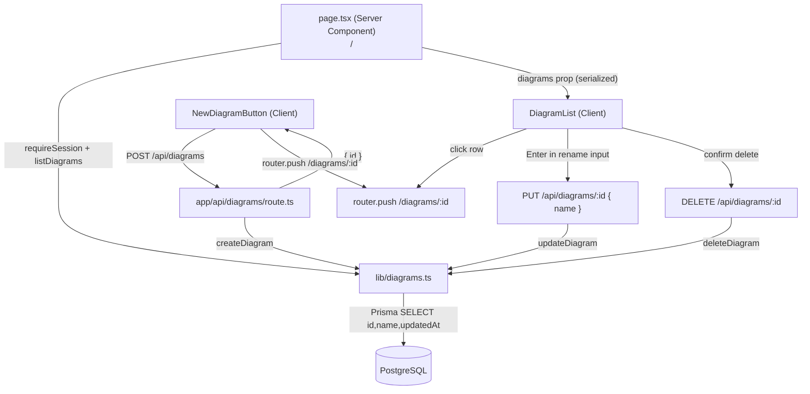

# M3 — Listing & Navigation Design

**Spec**: `.specs/features/m3-listing/spec.md`
**Status**: Draft

---

## Architecture Overview

M3 has two distinct halves: a thin data-layer addition (one new service function + one new route) and a larger UI layer built as client components initialized from server-rendered data.

**Data flows**:
- **Index load**: `page.tsx` (Server) → `listDiagrams(userId)` → `DiagramList` (client, receives serialized data as props)
- **Create**: `NewDiagramButton` → `POST /api/diagrams` → `router.push(/diagrams/:id)`
- **Rename**: `DiagramRow` → `PUT /api/diagrams/:id { name }` → optimistic update in `DiagramList` state
- **Delete**: `DiagramRow` → `DELETE /api/diagrams/:id` → optimistic removal from `DiagramList` state
- **Open**: `DiagramRow` click → `router.push(/diagrams/:id)` (client-side navigation)



---

## Ownership Enforcement Pattern (unchanged from M2b)

DELETE follows the same three-step pattern as GET and PUT:

```typescript
const session = await requireSession()           // 401 if missing
const deleted = await deleteDiagram(id, userId)  // deleteMany WHERE id AND userId
if (!deleted) return NextResponse.json({ error: "Forbidden" }, { status: 403 })
```

`deleteDiagram` uses `deleteMany({ where: { id, userId } })` — returns `false` when `count === 0`, which covers both "not found" and "wrong owner" without a separate pre-flight query.

---

## Data Layer

### `lib/diagrams.ts` — Add `deleteDiagram`

New export, following the existing `updateDiagram` pattern:

```typescript
export async function deleteDiagram(id: string, userId: string): Promise<boolean> {
  const result = await db.diagram.deleteMany({ where: { id, userId } })
  return result.count > 0
}
```

All other functions (`listDiagrams`, `updateDiagram`) already exist and are unchanged for M3.

---

## API Layer

### `DELETE /api/diagrams/:id` — Add to existing `[id]/route.ts`

```typescript
export async function DELETE(
  _req: NextRequest,
  { params }: { params: Promise<{ id: string }> }
) {
  let session
  try {
    session = await requireSession()
  } catch {
    return NextResponse.json({ error: "Unauthorized" }, { status: 401 })
  }

  const { id } = await params
  const deleted = await deleteDiagram(id, session.user.id)

  if (!deleted) {
    return NextResponse.json({ error: "Forbidden" }, { status: 403 })
  }

  return NextResponse.json({})
}
```

No request body needed. No Zod schema — `id` comes from the URL param (validated by Next.js routing).

---

## Components

### `app/(app)/page.tsx` — Updated Server Component

```typescript
export default async function DiagramIndexPage() {
  const session = await requireSession()
  const diagrams = await listDiagrams(session.user.id)

  return (
    <main className="min-h-screen bg-zinc-950">
      <DiagramList diagrams={diagrams} />
    </main>
  )
}
```

**Serialization note**: `Date` objects are serialized by Next.js to ISO strings when crossing the server→client boundary. `DiagramList` types `updatedAt` as `string` (not `Date`) and parses it for display. The server component passes `DiagramSummary[]` from `lib/diagrams.ts` directly — Next.js handles serialization automatically.

---

### `components/diagrams/DiagramList.tsx` — Client Component

**Purpose**: Owns the mutable list state; handles all mutation callbacks (create navigates away, rename/delete update in-place).

```typescript
type DiagramItem = {
  id: string
  name: string
  updatedAt: string  // ISO string — serialized from Date at server boundary
}

type Props = {
  diagrams: DiagramItem[]
}
```

**State**:
```typescript
const [items, setItems] = useState<DiagramItem[]>(props.diagrams)
```

**Rename handler** (optimistic):
```
1. Update name in items state immediately
2. Call PUT /api/diagrams/:id { name }
3. On failure: revert to original name in state + show error
```

**Delete handler** (optimistic):
```
1. Remove item from items state immediately
2. Call DELETE /api/diagrams/:id
3. On failure: re-insert item at original position in state + show error
```

**Layout**:
```
<header>
  <h1>Your Diagrams</h1>
  <NewDiagramButton />
</header>

{items.length === 0
  ? <DiagramEmptyState />
  : <ul>{items.map(item => <DiagramRow key={item.id} ... />)}</ul>
}
```

---

### `components/diagrams/DiagramRow.tsx` — Client Component

**Purpose**: Renders one diagram row. Manages its own rename-edit mode and delete-confirm mode.

**Local state**:
```typescript
type RowMode = "idle" | "renaming" | "confirm-delete"
const [mode, setMode] = useState<RowMode>("idle")
const [editValue, setEditValue] = useState(name)
```

**Idle mode layout**:
```
[clickable area → navigate]  [diagram name]  [last updated]  [rename icon]  [delete icon]
```

**Rename mode** (triggered by clicking name or rename icon):
```
[input pre-filled with name]  [Enter = commit]  [Escape = cancel]
```
- Enter: if value unchanged → cancel without PUT; if blank/whitespace → cancel without PUT; otherwise → call `onRename(id, value.trim())`
- Escape: restore `editValue` to original `name`, set mode `"idle"`
- Blur: treat as Escape (cancel, do NOT submit)

**Delete confirm mode** (triggered by clicking delete icon):
```
[Delete '{name}'? This cannot be undone.]  [Cancel]  [Delete]
```
- Inline within the row — no modal, no portal, no separate component
- Cancel: set mode `"idle"`
- Delete: call `onDelete(id)`, set mode `"idle"`

**Props**:
```typescript
type Props = {
  id: string
  name: string
  updatedAt: string
  onRename: (id: string, newName: string) => void
  onDelete: (id: string) => void
}
```

Navigation (open diagram): clicking the row area (not the rename/delete affordances) calls `router.push(/diagrams/${id})`.

---

### Timestamp Formatting

No date library. Simple inline utility in `DiagramRow`:

```typescript
function formatUpdatedAt(iso: string): string {
  const date = new Date(iso)
  const diffMs = Date.now() - date.getTime()
  const diffHours = diffMs / (1000 * 60 * 60)

  if (diffHours < 1) return "Just now"
  if (diffHours < 24) return `${Math.floor(diffHours)}h ago`
  return date.toLocaleDateString("en-US", { month: "short", day: "numeric", year: "numeric" })
}
```

---

## Route & File Structure

```
app/
└── (app)/
    └── page.tsx                              # Updated: async, requireSession, listDiagrams

app/api/diagrams/[id]/route.ts               # Updated: add DELETE handler

lib/
└── diagrams.ts                              # Updated: add deleteDiagram

components/
└── diagrams/
    ├── DiagramList.tsx                      # New: list state, optimistic updates
    └── DiagramRow.tsx                       # New: row with rename + delete confirm
```

`DiagramEmptyState` and `NewDiagramButton` are not separate files — they live inline in `DiagramList.tsx`. The naming in the spec was anticipatory; the actual scope doesn't justify separate files.

---

## State: Optimistic Update Strategy

| Operation | Optimistic action | On success | On failure |
|---|---|---|---|
| Rename | Update `name` in `items` state | No-op (state already correct) | Revert name in `items`, show row-level error |
| Delete | Remove item from `items` | No-op | Re-insert at original index, show row-level error |
| Create | — (navigates away immediately) | Editor page renders | Re-enable button, show error message |

Errors are scoped to the row — no global toast or banner needed for MVP.

---

## Error Handling

| Scenario | Response | UI Behavior |
|---|---|---|
| Unauthenticated at `/` | (middleware redirects) | Redirect to `/sign-in` — no change needed |
| DELETE 403 | Not owner or not found | Revert remove; show "Could not delete" inline |
| PUT (rename) 403 | Not owner or not found | Revert name; show "Could not rename" inline |
| POST 500 (create) | Server error | Re-enable "New Diagram" button; show error message |
| Network failure (any mutation) | fetch throws | Same as corresponding error above |

---

## Tech Decisions

| Decision | Choice | Rationale |
|---|---|---|
| Delete confirmation | Inline within `DiagramRow` (mode switch) | No modal library needed; simpler z-index; adequate for single-row destructive action |
| Rename commit trigger | Enter-only (not blur) | Blur fires when user clicks delete icon — would cause accidental rename + delete collision |
| `updatedAt` type in client | `string` (ISO) | Next.js serializes `Date` to string at server→client boundary; typing as `string` prevents runtime mismatch |
| Optimistic updates | Yes (for rename + delete) | List mutations feel instant; rollback is cheap |
| Timestamp formatter | Inline function, no library | No dependency needed for a 3-case formatter |
| EmptyState + NewDiagramButton | Inline in `DiagramList` | Scope is small; separate files add indirection without benefit |
| `listDiagrams` called directly | Server Component calls service directly | No API hop needed — same process, same session |
