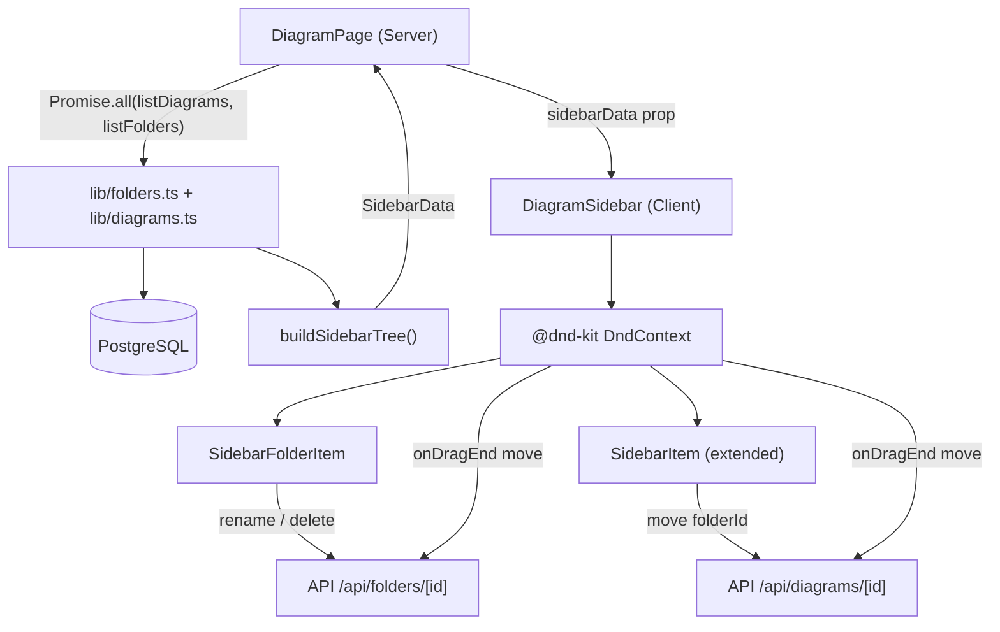

# Folders Feature Design

**Spec**: `.specs/features/m5-folders/spec.md`
**Status**: Draft

---

## Architecture Overview

Three layers change: DB schema → server lib → API routes. One layer is new: client-side DnD. The sidebar tree replaces the flat diagram list and becomes the main composition surface.



---

## Code Reuse Analysis

### Existing Components to Leverage

| Component | Location | How to use |
|---|---|---|
| `SidebarItem` | `components/sidebar/SidebarItem.tsx` | Extend — add `draggable` + drag handle; keep rename/delete logic |
| `DiagramSidebar` | `components/sidebar/DiagramSidebar.tsx` | Refactor — change prop from flat `diagrams[]` to `SidebarData`; same collapse/width/localStorage patterns |
| Optimistic update pattern | `DiagramSidebar` | Copy for folder create/rename/delete/move |
| Auth guard pattern | `app/api/diagrams/route.ts` | Copy `requireSession()` try/catch block into all new routes |
| Zod validation pattern | `app/api/diagrams/[id]/route.ts` | Copy schema + `safeParse` pattern into folder routes |
| `lib/diagrams.ts` | `lib/diagrams.ts` | Mirror exact pattern for `lib/folders.ts` |

### Integration Points

| System | Integration |
|---|---|
| Prisma schema | Add `Folder` model + `folderId` on `Diagram` — one migration |
| `DiagramPage` server component | Add `listFolders` call to existing `Promise.all`, pass tree to sidebar |
| `PUT /api/diagrams/[id]` | Add `folderId: z.string().nullable().optional()` to `UpdateDiagramSchema` + pass through `updateDiagram` patch |
| `updateDiagram` in `lib/diagrams.ts` | Add `folderId` to patch type and Prisma update call |

---

## Components

### `lib/folders.ts` (new)

- **Purpose**: Server-side CRUD for folders, mirroring `lib/diagrams.ts`
- **Location**: `lib/folders.ts`
- **Interfaces**:
  - `listFolders(userId: string): Promise<FolderSummary[]>` — flat list, all user's folders
  - `createFolder(userId: string, name?: string, parentFolderId?: string | null): Promise<FolderSummary>`
  - `updateFolder(id: string, userId: string, patch: { name?: string; parentFolderId?: string | null }): Promise<FolderSummary | null>`
  - `deleteFolder(id: string, userId: string): Promise<boolean>` — moves diagrams + subfolders to root in one transaction
- **Dependencies**: `lib/db.ts`, Prisma `Folder` model
- **Reuses**: Same structure as `lib/diagrams.ts`

```typescript
export type FolderSummary = {
  id: string
  name: string
  parentFolderId: string | null
  updatedAt: Date
}
```

`deleteFolder` transaction:
```typescript
await db.$transaction([
  db.diagram.updateMany({ where: { folderId: id }, data: { folderId: null } }),
  db.folder.updateMany({ where: { parentFolderId: id }, data: { parentFolderId: null } }),
  db.folder.deleteMany({ where: { id, userId } }),
])
```

---

### `lib/sidebar-tree.ts` (new)

- **Purpose**: Pure function — assembles flat DB lists into nested `SidebarData` for the client
- **Location**: `lib/sidebar-tree.ts`
- **Interfaces**:
  - `buildSidebarTree(folders: FolderSummary[], diagrams: DiagramSummary[]): SidebarData`
  - `isDescendant(tree: FolderNode[], ancestorId: string, candidateId: string): boolean` — circular-ref check, reused client-side
- **Dependencies**: none (pure)
- **Reuses**: nothing — new utility

```typescript
export type DiagramEntry = { id: string; name: string; updatedAt: string }

export type FolderNode = {
  id: string
  name: string
  parentFolderId: string | null
  children: FolderNode[]
  diagrams: DiagramEntry[]
}

export type SidebarData = {
  folders: FolderNode[]      // top-level only (parentFolderId === null)
  rootDiagrams: DiagramEntry[] // folderId === null
}
```

Algorithm: O(n) — one pass with a Map, no recursion at query time.

---

### `app/api/folders/route.ts` (new)

- **Purpose**: `GET` list all folders, `POST` create folder
- **Location**: `app/api/folders/route.ts`
- **Interfaces**:
  - `GET /api/folders` → `FolderSummary[]`
  - `POST /api/folders` body: `{ name?: string; parentFolderId?: string | null }` → `FolderSummary` 201
- **Dependencies**: `requireSession`, `lib/folders.ts`, Zod
- **Reuses**: Exact auth + Zod pattern from `app/api/diagrams/route.ts`

---

### `app/api/folders/[id]/route.ts` (new)

- **Purpose**: `PUT` rename/move folder, `DELETE` folder
- **Location**: `app/api/folders/[id]/route.ts`
- **Interfaces**:
  - `PUT /api/folders/[id]` body: `{ name?: string; parentFolderId?: string | null }` → `FolderSummary`
  - `DELETE /api/folders/[id]` → `{}` 200
- **Dependencies**: `requireSession`, `lib/folders.ts`, Zod
- **Reuses**: Exact auth + Zod pattern from `app/api/diagrams/[id]/route.ts`

> Server must validate circular reference on PUT: traverse `parentFolderId` chain until null or cycle detected. Reject with 422 if cycle found.

---

### `SidebarFolderItem` (new)

- **Purpose**: Renders a single folder row — expand toggle, name, rename, delete, drag handle
- **Location**: `components/sidebar/SidebarFolderItem.tsx`
- **Interfaces**:
  ```typescript
  type Props = {
    folder: FolderNode
    depth: number
    isExpanded: boolean
    onToggle: (id: string) => void
    onRename: (id: string, name: string) => void
    onDelete: (id: string) => void
    currentDiagramId: string
    // DnD props injected by @dnd-kit useDraggable / useDroppable
  }
  ```
- **Dependencies**: `@dnd-kit/core`, `SidebarItem` (renders child diagrams)
- **Reuses**: Rename/delete UX state machine from `SidebarItem` (ItemMode: idle | renaming | delete-pending)

Renders recursively: `SidebarFolderItem` renders children `SidebarFolderItem`s + child `SidebarItem`s when expanded.

---

### `DiagramSidebar` (refactor)

- **Purpose**: Orchestrator — manages tree state, expanded folders, DnD, optimistic updates
- **Location**: `components/sidebar/DiagramSidebar.tsx`
- **Key changes**:
  - Prop: `diagrams: DiagramEntry[]` → `initialData: SidebarData`
  - State: `items` (flat array) → `tree: SidebarData`
  - New state: `expandedFolders: Set<string>` (localStorage key `schemr:sidebar:expanded`)
  - New state: `creating: boolean` for folder create (separate from diagram create)
  - Wraps list in `<DndContext>` from `@dnd-kit/core`
  - `handleFolderCreate`, `handleFolderRename`, `handleFolderDelete`, `handleMove` (diagram or folder to new parent)
- **Reuses**: All existing collapse/resize/localStorage/optimistic-update patterns

---

### DnD Strategy

**Library**: `@dnd-kit/core` + `@dnd-kit/utilities`

Rationale: React-first, no DOM imperatives, works with virtualized lists, accessible by default, already popular in Next.js ecosystem. No `react-dnd` (legacy); no raw HTML5 DnD (no custom ghost, no auto-scroll).

**Draggable items**: every `SidebarItem` (diagram) and `SidebarFolderItem` (folder).

**Droppable targets**: every `SidebarFolderItem` + a root drop zone at the bottom of the list.

**`onDragEnd` handler in `DiagramSidebar`**:
1. Identify `active.data` type (`"diagram"` | `"folder"`) and `over.data` type (`"folder"` | `"root"`)
2. If folder dragged onto itself or descendant → no-op (client checked via `isDescendant`)
3. Optimistic update tree state
4. Call `PUT /api/folders/[id]` (if moving folder) or `PUT /api/diagrams/[id]` (if moving diagram) with new parent
5. On failure → rollback tree state

**Auto-expand on hover**: `onDragOver` handler sets a `setTimeout(600ms)` per folder. Clears on leave. Calls `expandFolder(id)`.

**Drag ghost**: `@dnd-kit` `DragOverlay` with a simplified item label.

---

### `DiagramPage` (server component — minor change)

```typescript
// Before
const [diagram, diagrams] = await Promise.all([
  getDiagramById(id, session!.user.id),
  listDiagrams(session!.user.id),
])

// After
const [diagram, diagrams, folders] = await Promise.all([
  getDiagramById(id, session!.user.id),
  listDiagrams(session!.user.id),
  listFolders(session!.user.id),
])
const sidebarData = buildSidebarTree(
  folders,
  diagrams.map((d) => ({ ...d, updatedAt: d.updatedAt.toISOString() }))
)
```

Prop passed to sidebar changes: `diagrams={serialized}` → `initialData={sidebarData}`.

---

## Data Models

### Prisma Schema (additions)

```prisma
model Folder {
  id             String    @id @default(cuid())
  name           String    @default("New Folder")
  userId         String
  user           User      @relation(fields: [userId], references: [id], onDelete: Cascade)
  parentFolderId String?
  parent         Folder?   @relation("FolderChildren", fields: [parentFolderId], references: [id], onDelete: SetNull)
  children       Folder[]  @relation("FolderChildren")
  diagrams       Diagram[]
  createdAt      DateTime  @default(now())
  updatedAt      DateTime  @updatedAt

  @@index([userId])
  @@index([parentFolderId])
}

model Diagram {
  // ... existing fields unchanged ...
  folderId  String?
  folder    Folder?  @relation(fields: [folderId], references: [id], onDelete: SetNull)
}

model User {
  // ... existing fields unchanged ...
  folders   Folder[]
}
```

`onDelete: SetNull` on `Folder.parent`: when a parent folder is deleted via cascade path, children get `parentFolderId = null` automatically. This is a safety net — app-level `deleteFolder` already handles it explicitly in a transaction.

---

## Error Handling Strategy

| Scenario | Handling | User sees |
|---|---|---|
| Create folder fails | Remove optimistic entry | Sidebar reverts; no toast needed (optimistic entry disappears) |
| Rename folder fails | Rollback to prev name | Name reverts instantly |
| Delete folder fails | Restore folder + children | Folder reappears; no toast |
| Move (DnD) fails | Rollback tree to pre-drag state | Item snaps back to original position |
| Circular ref rejected by server (422) | Client check prevents it first; server 422 is defensive fallback | Item snaps back |
| Network offline during DnD | Same rollback path as API failure | Item snaps back |

Toast/error display: match existing pattern — `createError` state shown inline as small text. No external toast library introduced.

---

## Tech Decisions

| Decision | Choice | Rationale |
|---|---|---|
| DnD library | `@dnd-kit/core` | React-first, accessible, no DOM imperatives, Next.js compatible |
| Tree assembly location | Server (DiagramPage) | Keeps client bundle lean; tree is read-only on mount, mutated optimistically |
| Circular ref check | Client-first (isDescendant), server validates | Client prevents bad UX; server is defensive guard |
| Delete behavior | App-level transaction (not DB cascade) | Explicit control; `SetNull` on schema is only a safety net |
| Folder list fetch | Flat list from DB, assembled into tree in lib | Avoids recursive Prisma query; O(n) assembly is fast for sidebar-scale data |
| expand/collapse storage | `localStorage` keyed by folder id | Same pattern as existing sidebar width/collapsed state |
| New diagram in folder | Out of scope (root only) | Create always lands in root; move via DnD |

---

## Files Changed / Created

| File | Change |
|---|---|
| `prisma/schema.prisma` | Add `Folder` model, `Diagram.folderId`, `User.folders` |
| `prisma/migrations/*/` | New migration for above |
| `lib/folders.ts` | New — CRUD |
| `lib/sidebar-tree.ts` | New — `buildSidebarTree`, `isDescendant` |
| `lib/diagrams.ts` | Add `folderId` to `updateDiagram` patch |
| `app/api/folders/route.ts` | New — GET + POST |
| `app/api/folders/[id]/route.ts` | New — PUT + DELETE |
| `app/api/diagrams/[id]/route.ts` | Add `folderId` to `UpdateDiagramSchema` |
| `app/(app)/diagrams/[id]/page.tsx` | Add `listFolders`, `buildSidebarTree`, pass `initialData` |
| `components/sidebar/DiagramSidebar.tsx` | Refactor — tree state, DnD, folder handlers |
| `components/sidebar/SidebarFolderItem.tsx` | New — folder row component |
| `components/sidebar/SidebarItem.tsx` | Add drag handle (minor) |
| `package.json` | Add `@dnd-kit/core`, `@dnd-kit/utilities` |
