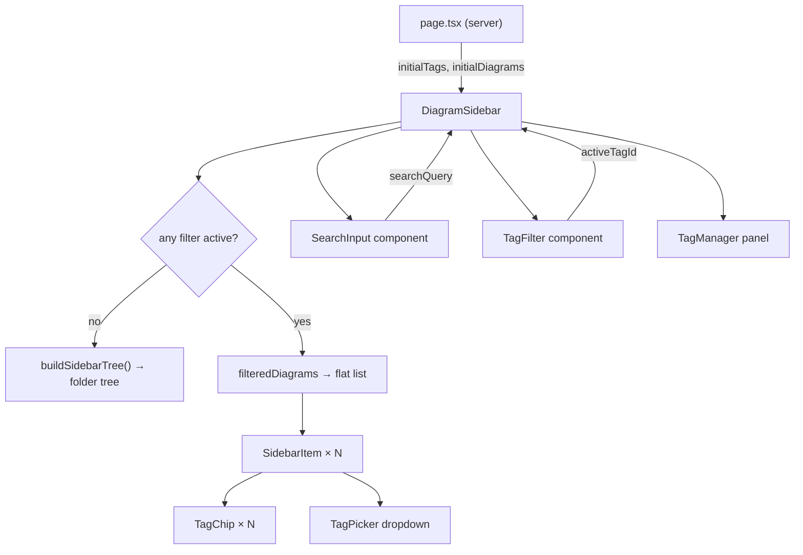

# Search + Tags Design

**Spec**: `.specs/features/m6-search-tags/spec.md`
**Status**: Draft

---

## Architecture Overview

Two independent concerns composed at the sidebar filter layer:

1. **Search** — pure client-side filter over `flatDiagrams` state already in `DiagramSidebar`. Zero new API calls. Adds one controlled input and a `useMemo` filter pass.

2. **Tags** — new data layer (Prisma models + REST endpoints) + UI components for CRUD, assignment, and filtering. Tags load once server-side (same pattern as diagrams/folders) and are managed via optimistic updates.

Both filters compose at `DiagramSidebar` via a single `useMemo` that produces `filteredDiagrams`. When either filter is active, the sidebar bypasses `buildSidebarTree()` and renders a flat list instead of the folder tree.



---

## Code Reuse Analysis

### Existing Components to Leverage

| Component | Location | How to Use |
|---|---|---|
| `DiagramSidebar` | `components/sidebar/DiagramSidebar.tsx` | Add `searchQuery`, `activeTagId`, `tags` state; extend `filteredDiagrams` memo |
| `SidebarItem` | `components/sidebar/SidebarItem.tsx` | Extend props to accept `tags: TagSummary[]`; add tag chip row and TagPicker trigger |
| `buildSidebarTree` | `lib/sidebar-tree.ts` | Keep as-is; bypassed when filter active, restored when both cleared |
| `listDiagrams` | `lib/diagrams.ts` | Extend `select` to include `tags { id, name }[]`; update `DiagramSummary` type |
| `requireSession` | `lib/auth.ts` (or similar) | Same auth guard used in all existing API routes |
| Zod validation pattern | `app/api/diagrams/route.ts` | Same `.safeParse()` + 400 response pattern for tag API routes |
| Optimistic update pattern | `DiagramSidebar` mutation handlers | Apply same pattern for tag CRUD and assignment |

### Integration Points

| System | Integration Method |
|---|---|
| `page.tsx` parallel fetch | Add `listTags(userId)` to the existing `Promise.all([getDiagramById, listDiagrams, listFolders])` |
| `DiagramSummary` type | Extend with `tags: TagSummary[]`; threaded through sidebar-tree and all item components |
| Prisma cascade delete | `DiagramTag` records cascade on `Tag` delete; `onDelete: Cascade` on both FK sides |

---

## Components

### `SearchInput`

- **Purpose**: Controlled text input at the top of the expanded sidebar for real-time diagram name search.
- **Location**: `components/sidebar/SearchInput.tsx`
- **Interfaces**:
  - `value: string` — controlled value
  - `onChange(value: string): void` — fires on every keystroke
  - `onClear(): void` — clears value (shows × button when `value` non-empty)
- **Dependencies**: None — pure UI.
- **Reuses**: Existing sidebar CSS tokens/classNames for consistent styling.

---

### `TagChip`

- **Purpose**: Renders a single tag name as a small pill. Optionally shows a remove (×) button.
- **Location**: `components/sidebar/TagChip.tsx`
- **Interfaces**:
  - `name: string`
  - `onRemove?: () => void` — when present, renders × button; omit for read-only chips
  - `active?: boolean` — highlight state for filter bar active tag
- **Dependencies**: None.
- **Reuses**: Nothing — new small primitive.

---

### `TagFilter`

- **Purpose**: Horizontal scrollable row of `TagChip` pills below the search input. Clicking a chip sets `activeTagId`; clicking the active one deselects it.
- **Location**: `components/sidebar/TagFilter.tsx`
- **Interfaces**:
  - `tags: TagSummary[]`
  - `activeTagId: string | null`
  - `onSelect(tagId: string | null): void`
- **Dependencies**: `TagChip`.
- **Reuses**: Same sidebar scroll/overflow pattern.

---

### `TagManager`

- **Purpose**: Inline panel (fixed overlay inside sidebar) for tag CRUD — lists all tags, create form, delete with confirmation.
- **Location**: `components/sidebar/TagManager.tsx`
- **Interfaces**:
  - `tags: TagSummary[]`
  - `onCreate(name: string): Promise<void>`
  - `onDelete(tagId: string): Promise<void>`
  - `onClose(): void`
- **Dependencies**: `TagChip` (for rendering tag list items).
- **Reuses**: Existing delete-confirm pattern from `SidebarItem` (3-state: idle → confirm → done).
- **Notes**: Opened from a "Manage tags" button in the sidebar header. Rendered inline (not a portal) — same approach as the existing create-folder / rename flows. Spec requires delete confirmation (AC TAG-02 step 6).

---

### `TagPicker`

- **Purpose**: Dropdown combobox attached to a diagram item for assigning/removing tags. Opened via "Add tag" button on `SidebarItem`.
- **Location**: `components/sidebar/TagPicker.tsx`
- **Interfaces**:
  - `availableTags: TagSummary[]` — user's full tag list
  - `assignedTagIds: string[]`
  - `onAssign(tagId: string): Promise<void>`
  - `onRemove(tagId: string): Promise<void>`
  - `onCreateAndAssign(name: string): Promise<void>` — P2: inline create
  - `onClose(): void`
- **Dependencies**: `TagChip` for selected tag display.
- **Reuses**: Pattern from diagram rename — escape closes, click-outside closes.

---

### `DiagramSidebar` (extended)

- **Purpose**: Extend existing sidebar to own search + tag filter state and pass filtered data to item tree.
- **Location**: `components/sidebar/DiagramSidebar.tsx`
- **New state**:
  - `searchQuery: string` — controlled by `SearchInput`
  - `activeTagId: string | null` — controlled by `TagFilter`
  - `tags: TagSummary[]` — initialized from `initialTags` prop
  - `tagManagerOpen: boolean`
- **New `filteredDiagrams` memo**:
  ```ts
  const filteredDiagrams = useMemo(() => {
    const q = searchQuery.trim().toLowerCase()
    return flatDiagrams
      .filter(d => !q || d.name.toLowerCase().includes(q))
      .filter(d => !activeTagId || d.tags.some(t => t.id === activeTagId))
  }, [flatDiagrams, searchQuery, activeTagId])
  ```
- **Render logic**: When `searchQuery || activeTagId` is truthy → render `filteredDiagrams` as flat list. Otherwise → existing `buildSidebarTree()` branch.
- **Reuses**: All existing folder tree, DnD, and CRUD logic unchanged.

---

### `SidebarItem` (extended)

- **Purpose**: Extend to show tag chips for the current diagram and expose TagPicker.
- **New props**:
  - `tags: TagSummary[]` — assigned tags for this diagram
  - `allTags: TagSummary[]` — all user tags (for picker)
  - `onTagAssign(tagId: string): Promise<void>`
  - `onTagRemove(tagId: string): Promise<void>`
  - `onTagCreate(name: string): Promise<void>` — P2
- **Chip display rule**: P1 — show chips only on `isCurrent` item. P2 — show up to 2 chips on all items, hide on narrow sidebar.

---

### API Route: `lib/tags.ts` (new)

- **Purpose**: Data-access functions for tag operations. Follows same pattern as `lib/diagrams.ts` and `lib/folders.ts`.
- **Location**: `lib/tags.ts`
- **Interfaces**:
  ```ts
  listTags(userId: string): Promise<TagSummary[]>
  createTag(userId: string, name: string): Promise<TagSummary>
  deleteTag(userId: string, tagId: string): Promise<void>
  assignTag(userId: string, diagramId: string, tagId: string): Promise<void>
  removeTag(userId: string, diagramId: string, tagId: string): Promise<void>
  ```
- **Reuses**: `db` Prisma client (same import pattern as other lib files).

---

## Data Models

### Prisma additions (`prisma/schema.prisma`)

```prisma
model Tag {
  id        String       @id @default(cuid())
  name      String
  userId    String
  user      User         @relation(fields: [userId], references: [id], onDelete: Cascade)
  diagrams  DiagramTag[]
  createdAt DateTime     @default(now())

  @@unique([userId, name])
  @@index([userId])
}

model DiagramTag {
  diagramId  String
  tagId      String
  diagram    Diagram  @relation(fields: [diagramId], references: [id], onDelete: Cascade)
  tag        Tag      @relation(fields: [tagId], references: [id], onDelete: Cascade)
  assignedAt DateTime @default(now())

  @@id([diagramId, tagId])
}
```

`User` and `Diagram` models get back-relations:
```prisma
// in User:
tags  Tag[]

// in Diagram:
tags  DiagramTag[]
```

### TypeScript types

```typescript
type TagSummary = {
  id: string
  name: string
}

// Extended (existing type gains new field):
type DiagramSummary = {
  id: string
  name: string
  updatedAt: Date
  folderId: string | null
  thumbnail: string | null
  tags: TagSummary[]   // NEW
}
```

---

## API Endpoints

All routes follow existing pattern: `requireSession()` → Zod validation → Prisma → JSON response.

| Method | Route | Handler | Validates |
|---|---|---|---|
| `GET` | `/api/tags` | `listTags(userId)` | — |
| `POST` | `/api/tags` | `createTag(userId, name)` | `name: z.string().min(1).max(32).trim()` |
| `DELETE` | `/api/tags/:id` | `deleteTag(userId, id)` | path param |
| `POST` | `/api/diagrams/:id/tags/:tagId` | `assignTag(userId, id, tagId)` | path params |
| `DELETE` | `/api/diagrams/:id/tags/:tagId` | `removeTag(userId, id, tagId)` | path params |

**Cascade**: `deleteTag` deletes the `Tag` row; Prisma `onDelete: Cascade` on `DiagramTag.tagId` handles the join table cleanup automatically.

**Duplicate check**: Prisma `@@unique([userId, name])` throws `P2002` — catch and return 409 with `"Tag already exists"`.

---

## Error Handling Strategy

| Error Scenario | Handling | User Sees |
|---|---|---|
| Tag name empty / whitespace | Client-side check before API call | Inline error below input |
| Tag name > 32 chars | Client-side check + server Zod | "Max 32 characters" |
| Duplicate tag name | Server 409 → client catches | "Tag already exists" |
| Tag delete — network error | Rollback `tags` state (optimistic) | Inline error in TagManager |
| Assign tag — diagram not owned | Server 404 (userId check) | Silent no-op + console error |
| Both filters active, no results | Single empty state | "No diagrams match" (covers edge case from spec) |
| Diagram deleted while tag filter active | `flatDiagrams` update triggers `filteredDiagrams` recompute → removed automatically | Diagram disappears from filtered list |

---

## Tech Decisions

| Decision | Choice | Rationale |
|---|---|---|
| Search filter location | `DiagramSidebar` local state | Sidebar-local UI state; no cross-component need |
| Tag state location | `DiagramSidebar` local state (`tags[]`, `activeTagId`) | Consistent with how `flatDiagrams`/`flatFolders` are managed today |
| Tag initial load | Server fetch in `page.tsx` via `listTags()` → passed as `initialTags` prop | Same SSR pattern as diagrams/folders; zero client waterfall |
| TagManager UX | Inline overlay panel within sidebar | No new dialog lib dep; consistent with existing inline-modal patterns |
| `listDiagrams` tags include | Prisma `include: { tags: { select: { tag: { select: { id, name } } } } }` then map | One query; avoids N+1 |
| P1 chip visibility | Current diagram only | Keeps sidebar density low; P2 extends to all items |
| Flat list vs tree when filter active | Flat list | Spec AC SRCH-03 and TAG-07 both require flatten; simplest to switch render branches |

---

## Requirement Traceability

| Req ID | Component / Layer |
|---|---|
| SRCH-01 | `SearchInput` + `DiagramSidebar` (show when expanded) |
| SRCH-02 | `filteredDiagrams` useMemo in `DiagramSidebar` |
| SRCH-03 | Flat list render branch in `DiagramSidebar` |
| SRCH-04 | Empty state in flat list render branch |
| SRCH-05 | `searchQuery` clear → restores tree branch |
| TAG-01 | `TagManager` + `POST /api/tags` + `lib/tags.ts:createTag` |
| TAG-02 | `TagManager` + `DELETE /api/tags/:id` + Prisma cascade |
| TAG-03 | Client validation + server 409 in `POST /api/tags` |
| TAG-04 | `TagPicker` + `POST /api/diagrams/:id/tags/:tagId` |
| TAG-05 | `TagChip` onRemove + `DELETE /api/diagrams/:id/tags/:tagId` |
| TAG-06 | `SidebarItem` tag chips (P1: current diagram only) |
| TAG-07 | Flat list render branch when `activeTagId` set |
| TAG-08 | `TagChip active` prop in `TagFilter` |
| TAG-09 | Intersection logic in `filteredDiagrams` memo |
| TAG-10 | `TagPicker.onCreateAndAssign` — P2 |
| TAG-11 | `SidebarItem` chips on non-current items — P2 |
