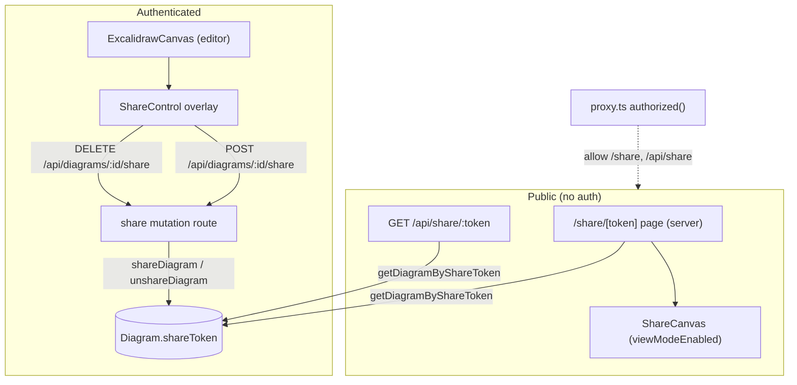

# Public Share Link Design

**Spec**: `.specs/features/m7-share-link/spec.md`
**Status**: Draft

---

## Architecture Overview

Three concerns, one additive schema change:

1. **Owner mutation** — authenticated `POST`/`DELETE /api/diagrams/:id/share` endpoints mint/clear a `shareToken`, reusing the exact ownership pattern of existing diagram routes (`requireSession()` → `userId` from session).

2. **Public read** — an unauthenticated `GET /api/share/:token` endpoint and a public `/share/[token]` page, both living **outside** the `(app)` auth group. They resolve a diagram by token, selecting only `name` + `data`. The auth middleware must be told to let these through.

3. **View-only render** — a new `ShareCanvas` client component wraps Excalidraw with `viewModeEnabled`, with **none** of the autosave / `onChange` / `beforeunload` wiring that `ExcalidrawCanvas` carries. This guarantees a public visitor can never trigger a write.

The one write into the owner's editor: `getDiagramById` gains `shareToken` so the editor chrome can show current share state and drive the share control.



> Diagram rendered inline. `mermaid-studio` skill is available — if a rendered SVG/PNG is wanted for docs, delegate there. (Recommendation shown once.)

---

## Code Reuse Analysis

### Existing Components to Leverage

| Component | Location | How to Use |
|---|---|---|
| `requireSession` | `lib/auth.ts` | Guard the two owner share-mutation routes, same as all diagram routes |
| Ownership pattern | `app/api/diagrams/[id]/route.ts` | Copy the `getDiagramById(id, userId)` → 403-if-null shape for share mutations |
| `lib/diagrams.ts` data layer | `lib/diagrams.ts` | Add `shareDiagram` / `unshareDiagram` / `getDiagramByShareToken`; extend `DiagramDetail` with `shareToken` |
| `deserializeCanvas` | `lib/excalidraw.ts` | Reuse to hydrate `data` for the public page, identical to `getDiagramById` |
| `ExcalidrawCanvas` | `components/excalidraw/ExcalidrawCanvas.tsx` | **Reference, do not extend** — `ShareCanvas` mirrors its dynamic-import + Excalidraw mount but drops all save wiring |
| `ExcalidrawEditor` dynamic import | `components/excalidraw/ExcalidrawEditor.tsx` | Same `dynamic(..., { ssr: false })` pattern for `ShareCanvas` (Excalidraw is client-only) |
| Zod + `safeParse` | existing routes | Path-param validation on token / id |
| `notFound()` | `app/(app)/diagrams/[id]/page.tsx` | Public page calls `notFound()` on missing/revoked token → renders `not-found.tsx` |

### Integration Points

| System | Integration Method |
|---|---|
| Auth middleware (`auth.config.ts` `authorized`) | Add `/share` (page) and `/api/share` (API) to the public allowlist alongside `/sign-in`, `/sign-up` |
| `getDiagramById` callers | Adding `shareToken` to the return is additive; existing callers ignore the new field |
| Editor page → editor component | Thread `shareToken` from `getDiagramById` through `ExcalidrawEditor` into the `ShareControl` overlay |
| Prisma migration | Additive nullable unique column — no data backfill, no downtime |

---

## Components

### `ShareControl` (new)

- **Purpose**: Owner-facing control in the editor to enable/copy/revoke a share link.
- **Location**: `components/excalidraw/ShareControl.tsx`
- **Interfaces**:
  - `diagramId: string`
  - `initialShareToken: string | null` — from `getDiagramById`
- **Behavior**:
  - Private state → "Share" button; click opens a small popover with an "Enable public link" action.
  - Enable → `POST /api/diagrams/:id/share` → store returned token, render full URL + "Copy link" button (uses `navigator.clipboard.writeText`).
  - Shared state → popover shows the URL, copy button, and "Stop sharing" (revoke) with a confirm step.
  - Revoke → `DELETE /api/diagrams/:id/share` → clear local token → back to private.
  - Builds URL client-side: `${window.location.origin}/share/${token}`.
- **Dependencies**: none beyond fetch + clipboard API.
- **Reuses**: the 3-state confirm interaction (idle → confirm → done) already used for delete in `SidebarItem`.

### `ShareCanvas` (new)

- **Purpose**: Read-only Excalidraw render for the public page — no save, no sidebar, no mutation surface.
- **Location**: `components/excalidraw/ShareCanvas.tsx`
- **Interfaces**:
  - `data: ExcalidrawState`
  - `name: string`
- **Behavior**:
  - Mounts `<Excalidraw viewModeEnabled initialData={data} />`. No `onChange`, no `excalidrawAPI` save ref, no `useSaveStatus`, no `beforeunload` listener, no `SaveIndicator`.
  - Renders the diagram `name` in a lightweight read-only header bar.
- **Dependencies**: `@excalidraw/excalidraw`.
- **Reuses**: same `dynamic(() => import(...), { ssr: false })` mounting approach as `ExcalidrawEditor`.
- **Note**: `viewModeEnabled` is a first-class Excalidraw prop; it disables all editing tools while keeping pan/zoom. Belt-and-suspenders: also omit any handlers that could persist state.

### `ExcalidrawEditor` (extended)

- **Change**: accept `shareToken: string | null`, pass through to render `<ShareControl>` as an overlay (alongside where `SaveIndicator` sits). Keeps `ExcalidrawCanvas` itself unchanged.

---

## Data Layer (`lib/diagrams.ts`)

```ts
// mint if absent, idempotent — returns existing token when already shared
shareDiagram(id: string, userId: string): Promise<{ shareToken: string } | null>
// null => not owned / not found (caller returns 403/404)

// clear token; returns false if not owned / not found
unshareDiagram(id: string, userId: string): Promise<boolean>

// public lookup — selects ONLY name + data, no relations, no userId
getDiagramByShareToken(token: string): Promise<{ name: string; data: ExcalidrawState } | null>
```

- `shareDiagram`: `updateMany({ where: { id, userId } })` guard, or `findFirst` then generate. Generate token with `crypto.randomBytes(16).toString("base64url")`. On `@unique` collision (P2002) → regenerate (retry loop, max ~3).
- `getDiagramByShareToken`: `db.diagram.findUnique({ where: { shareToken: token }, select: { name: true, data: true } })`. **No `include`, no `userId` in select.**
- `getDiagramById` (existing): add `shareToken: true` to select and to `DiagramDetail`.

---

## Data Models

### Prisma addition (`prisma/schema.prisma`)

```prisma
model Diagram {
  // ...existing fields...
  shareToken String? @unique   // null = private; present = publicly shared
}
```

Migration: `add_diagram_share_token` — additive nullable column with unique index. No backfill.

### TypeScript

```ts
// extended existing type
type DiagramDetail = DiagramSummary & {
  data: ExcalidrawState
  shareToken: string | null   // NEW
}

// public payload — deliberately minimal, its own type (not DiagramDetail)
type SharedDiagram = {
  name: string
  data: ExcalidrawState
}
```

---

## API Endpoints

| Method | Route | Auth | Handler | Validates |
|---|---|---|---|---|
| `POST` | `/api/diagrams/:id/share` | session (owner) | `shareDiagram(id, userId)` | path `id` |
| `DELETE` | `/api/diagrams/:id/share` | session (owner) | `unshareDiagram(id, userId)` | path `id` |
| `GET` | `/api/share/:token` | **none** | `getDiagramByShareToken(token)` | path `token` |

- Owner routes: `requireSession()` → handler returns null/false → respond `403`. Same shape as `app/api/diagrams/[id]/route.ts`.
- `POST` responds `{ shareToken }` (`200`), idempotent — returns existing token if already shared (SHARE-05).
- `DELETE` responds `204`.
- `GET /api/share/:token` responds `{ name, data }` or `404`. Never a redirect.

### New page

- `app/share/[token]/page.tsx` — server component, **outside `(app)`**. Awaits `params`, calls `getDiagramByShareToken(token)`, `notFound()` if null, else renders `<ShareCanvas data name />`. Uses root layout (no sidebar, no `requireSession`).
- `app/share/[token]/not-found.tsx` — "This link is no longer available." (SHARE-09).

### Middleware change (`auth.config.ts`)

```ts
authorized({ auth, request: { nextUrl } }) {
  const isLoggedIn = !!auth?.user
  const p = nextUrl.pathname
  const isPublic =
    p === "/sign-in" || p === "/sign-up" ||
    p.startsWith("/share/") || p.startsWith("/api/share/")
  if (isPublic) return true
  return isLoggedIn
}
```

`proxy.ts` matcher already excludes static + `api/auth`; `/api/share` is *not* excluded there, so the `authorized` allowlist above is what lets it through. (Alternative: add `api/share` to the matcher negative-lookahead — but the callback allowlist is clearer and keeps all public-path logic in one place.)

---

## Error Handling Strategy

| Scenario | Handling | Visitor / Owner sees |
|---|---|---|
| Token missing / revoked / malformed | `getDiagramByShareToken` → null → `notFound()` / API `404` | "This link is no longer available" |
| Non-owner tries to share/revoke | `updateMany`/`findFirst` `where userId` matches 0 rows → null/false → `403` | no state change |
| Token `@unique` collision on mint | Catch P2002 → regenerate (≤3 retries) | transparent success |
| Clipboard API unavailable | `ShareControl` falls back to a selectable text field | URL shown for manual copy |
| Diagram deleted while shared | Row + token gone → `404` | "no longer available" |
| Shared diagram edited + saved | Public page reads latest on next load (live) | updated content |
| Empty `data` | `ShareCanvas` renders empty read-only canvas | blank canvas + name |

---

## Security Notes

- Token: `crypto.randomBytes(16)` = 128 bits, base64url → unguessable, unenumerable. No sequential IDs in URL.
- Public read path selects **only** `name` + `data`. No `userId`, `user`, `tags`, `folderId`, `thumbnail`, timestamps. Enforced at the Prisma `select`, not by post-filtering.
- Owner mutations derive `userId` from session exclusively — never from body/query.
- Public routes reachable without auth **by design**; the middleware allowlist is the single controlled entry point. Everything else stays behind `authorized`.
- `ShareCanvas` has no code path that issues a write — the public bundle cannot save even if `viewModeEnabled` were bypassed client-side, because the mutation endpoints require a session cookie the visitor lacks.

---

## Tech Decisions

| Decision | Choice | Rationale |
|---|---|---|
| Share state model | single nullable `shareToken @unique` | Presence = shared; no extra bool or table; revoke = null |
| Content freshness | live latest-saved (no snapshot) | Simplest; no snapshot storage; matches spec |
| Revoke semantics | clear token; re-enable mints new | Old URLs die permanently — safest for the user |
| Read-only render | separate `ShareCanvas`, not extended `ExcalidrawCanvas` | Zero risk of autosave/beacon firing on a public route |
| Route placement | `app/share/[token]` outside `(app)` | Avoids the authenticated layout + sidebar; own minimal chrome |
| Public-path gating | allowlist in `authorized` callback | One place for all public-path logic; clearer than matcher regex |
| Token generation | `crypto.randomBytes(16).base64url` | 128-bit CSPRNG, URL-safe, no dependency |
| Share endpoint shape | sub-resource `/api/diagrams/:id/share` | Mirrors existing `/api/diagrams/:id/tags/:tagId` sub-resource convention |

---

## Requirement Traceability

| Req ID | Component / Layer |
|---|---|
| SHARE-01 | `ShareControl` (reads `initialShareToken`) |
| SHARE-02 | `shareDiagram` + `POST /api/diagrams/:id/share` |
| SHARE-03 | `ShareControl` copy button (`navigator.clipboard`) |
| SHARE-04 | `requireSession` + `userId`-scoped `updateMany`/`findFirst` |
| SHARE-05 | `shareDiagram` idempotent (returns existing token) |
| SHARE-06 | `app/share/[token]/page.tsx` + `ShareCanvas` (`viewModeEnabled`) + middleware allowlist |
| SHARE-07 | `ShareCanvas` name header |
| SHARE-08 | `getDiagramByShareToken` select `{ name, data }` only |
| SHARE-09 | `getDiagramByShareToken` null → `notFound()` / `404`; middleware returns true so no sign-in redirect |
| SHARE-10 | Public page has no `requireSession`; renders same view for anyone |
| SHARE-11 | `unshareDiagram` + `DELETE /api/diagrams/:id/share` |
| SHARE-12 | Token null → `findUnique` miss → `404` |
| SHARE-13 | `shareDiagram` generates fresh token after revoke |
| SHARE-14 | `ShareControl` revoke confirm step |
| SHARE-15 | `ShareControl` public indicator (P2) |

---

## Test Strategy (per TESTING.md)

- **Integration** (real Postgres): `shareDiagram` idempotency, `unshareDiagram` ownership guard, `getDiagramByShareToken` returns only name+data and null for revoked/missing token, re-enable mints a different token.
- **Unit**: `ShareControl` state transitions (private → shared → revoke-confirm → private), copy invokes clipboard.
- **E2E** (Playwright): owner enables share → copies URL → open URL in a fresh (unauthenticated) context → read-only canvas renders with name, no sidebar, editing disabled → owner revokes → reload → 404 page.
