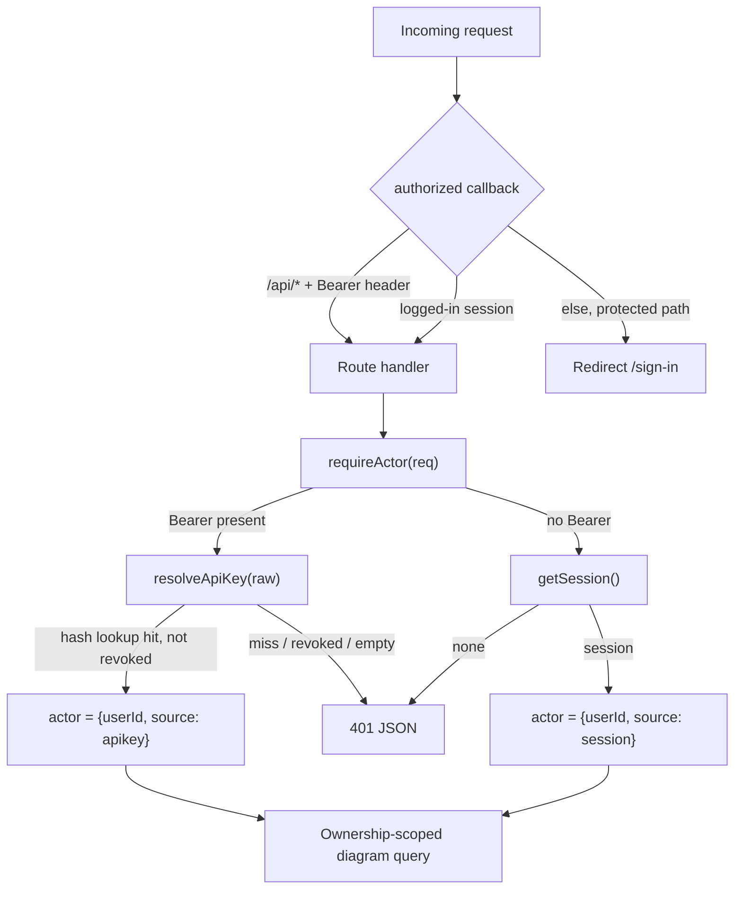

# Machine Auth (API Keys) Design

**Spec**: `.specs/features/m8-api-keys/spec.md`
**Status**: Draft

---

## Architecture Overview

M8 introduces a second authentication path that converges on the same `userId` the routes already
trust. Today every route calls `requireSession()` → `session.user.id`. We generalize that to an
**actor**: a `{ userId, source }` resolved from **either** a bearer API key **or** a browser session.
Route logic downstream is unchanged — it still gets a `userId` and applies the same ownership scoping.

Two gates sit in front of a diagram route: the NextAuth middleware (`authorized` callback in
`auth.config.ts`) and the route handler's own auth. The middleware currently redirects any
non-logged-in request to `/sign-in` — fatal for a headless bearer client. We add a narrow allowance:
a `/api/*` request carrying an `Authorization: Bearer` header passes the middleware, then the handler
does the real validation via `requireActor`. Passing the middleware grants nothing on its own.



Key management (`/api/api-keys*`) deliberately does **not** use `requireActor` — it stays
session-only so a leaked key cannot mint or revoke keys.

---

## Code Reuse Analysis

### Existing Components to Leverage

| Component | Location | How to Use |
|---|---|---|
| `requireSession` / `getSession` | `lib/auth.ts` | Extend this file with `resolveActor` / `requireActor`; reuse `getSession` as the session branch |
| `db` (Prisma client) | `lib/db.ts` | All `ApiKey` queries |
| CSPRNG token pattern | `lib/diagrams.ts` (`randomBytes(16).toString("base64url")` for `shareToken`) | Same approach, 32 bytes, `sk_` prefix |
| Owner-scoped null→403 pattern | `app/api/diagrams/[id]/route.ts` | Reuse verbatim for revoke ownership scoping |
| Zod request parsing + `safeParse`→400 | `app/api/diagrams/route.ts`, `app/api/auth/register/route.ts` | Same validation shape for the create-key body |
| Public-path allowlist in `authorized` | `auth.config.ts` (already lets `/share/`, `/api/share/` through) | Add the bearer `/api/*` allowance next to it |
| Additive-migration pattern | `prisma/migrations/*_add_diagram_share_token` | Same style for the `ApiKey` table |
| Dropdown/menu + click-outside pattern | `components/sidebar/UserMenu.tsx` | Reuse interaction pattern; add an "API keys" link to it |
| 3-state confirm interaction (idle→confirm→done) | `components/sidebar/SidebarItem.tsx` (delete) | Reuse for revoke confirmation in the key manager |

### Integration Points

| System | Integration Method |
|---|---|
| NextAuth middleware | Add a bearer-gated allowance in the `authorized` callback |
| Existing diagram routes | Swap `requireSession()` → `requireActor(req)`; `session.user.id` → `actor.userId` |
| Prisma schema | New `ApiKey` model + `User.apiKeys` back-relation; additive migration |
| Settings navigation | New `/settings/api-keys` page linked from `UserMenu` |

---

## Components

### `ApiKey` data model + migration

- **Purpose**: Persist per-user API keys as hashes with lifecycle metadata.
- **Location**: `prisma/schema.prisma` + new migration
- **Interfaces**: Prisma-generated `db.apiKey.*`
- **Dependencies**: Postgres, Prisma
- **Reuses**: Additive-migration convention

### `lib/api-key.ts`

- **Purpose**: All API-key crypto + persistence logic, isolated from route code.
- **Location**: `lib/api-key.ts` (new)
- **Interfaces**:
  - `generateApiKey(): { raw: string; hashedKey: string; prefix: string }` — pure; `raw = "sk_" + base64url(randomBytes(32))`, `hashedKey = sha256hex(raw)`, `prefix = raw.slice(0, 11)`.
  - `hashApiKey(raw: string): string` — pure; sha-256 hex of the full raw key.
  - `createApiKey(userId: string, label?: string): Promise<{ id: string; raw: string; prefix: string; label: string }>` — persists hash+prefix, returns raw once; retries on `P2002` (≤3).
  - `listApiKeys(userId: string): Promise<ApiKeySummary[]>` — metadata only; **never** selects `hashedKey`.
  - `revokeApiKey(id: string, userId: string): Promise<boolean>` — owner-scoped; sets `revokedAt`; `false` if not owned or already gone.
  - `resolveApiKey(raw: string): Promise<{ userId: string; scopes: string[] } | null>` — `sk_`-guard → hash → `findUnique({ where: { hashedKey } })` → null if missing/revoked → best-effort `lastUsedAt` bump → returns owner.
- **Dependencies**: `node:crypto`, `db`
- **Reuses**: `shareToken` CSPRNG pattern; ownership-scoped query pattern

### `lib/auth.ts` — actor resolution (extend existing file)

- **Purpose**: Resolve a request to a single `userId` from bearer key OR session.
- **Location**: `lib/auth.ts` (extend)
- **Interfaces**:
  - `type Actor = { userId: string; source: "session" | "apikey" }`
  - `resolveActor(req: Request): Promise<Actor | null>` — if `Authorization: Bearer <x>` present, resolve **only** via `resolveApiKey` (no session fallthrough on failure); else use `getSession`.
  - `requireActor(req: Request): Promise<Actor>` — throws `NextResponse.json(401)` on null, mirroring `requireSession`.
- **Dependencies**: `resolveApiKey`, `getSession`
- **Reuses**: `requireSession` throw-Response idiom

### `authorized` middleware allowance

- **Purpose**: Let bearer-carrying API requests reach their handler.
- **Location**: `auth.config.ts` (modify `authorized`)
- **Interfaces**: within `authorized({ request, nextUrl })` — `if (p.startsWith("/api/") && request.headers.get("authorization")?.startsWith("Bearer ")) return true`
- **Dependencies**: none
- **Reuses**: existing `isPublic` allowlist structure

### Diagram routes (modify)

- **Purpose**: Accept session **or** bearer on the diagram API.
- **Location**: `app/api/diagrams/route.ts`, `app/api/diagrams/[id]/route.ts`
- **Interfaces**: unchanged HTTP contract; internally `requireActor(req)` + `actor.userId`. `GET /api/diagrams` gains a `req: NextRequest` param (currently omitted).
- **Dependencies**: `requireActor`
- **Reuses**: existing handler bodies verbatim aside from the auth line

### Key-management routes

- **Purpose**: Session-only CRUD for the caller's keys.
- **Location**: `app/api/api-keys/route.ts` (GET list, POST create), `app/api/api-keys/[id]/route.ts` (DELETE revoke)
- **Interfaces**: `GET` → `ApiKeySummary[]`; `POST {label?}` → `{ id, key, prefix, label }` (201); `DELETE` → 204 / 403.
- **Dependencies**: `requireSession` (NOT `requireActor`), `lib/api-key.ts`, `zod`
- **Reuses**: Zod parse pattern; null→403 ownership pattern

### `ApiKeyManager` component

- **Purpose**: Client UI to create, reveal-once, list, and revoke keys.
- **Location**: `components/settings/ApiKeyManager.tsx` (new)
- **Interfaces**: `props: { initialKeys: ApiKeySummary[] }`; calls the key routes via `fetch`.
- **Dependencies**: key routes
- **Reuses**: `UserMenu` menu/state patterns; `SidebarItem` confirm-to-revoke pattern

### `/settings/api-keys` page + nav link

- **Purpose**: Authenticated host page for the manager; entry point from `UserMenu`.
- **Location**: `app/(app)/settings/api-keys/page.tsx` (new), `components/sidebar/UserMenu.tsx` (add link)
- **Interfaces**: server component — `requireSession`, `listApiKeys(userId)`, render `<ApiKeyManager initialKeys>`.
- **Dependencies**: `requireSession`, `listApiKeys`, `ApiKeyManager`
- **Reuses**: `(app)` layout group; `UserMenu` link slot

---

## Data Models

```typescript
// lib/api-key.ts
export type ApiKeySummary = {
  id: string
  label: string
  prefix: string          // e.g. "sk_a1b2c3d" — display handle, not the secret
  scopes: string[]
  lastUsedAt: Date | null
  revokedAt: Date | null  // null = active
  createdAt: Date
}

// lib/auth.ts
export type Actor = { userId: string; source: "session" | "apikey" }
```

```prisma
model ApiKey {
  id         String    @id @default(cuid())
  userId     String
  label      String    @default("API key")
  hashedKey  String    @unique
  prefix     String
  scopes     String[]  @default(["diagrams"])
  lastUsedAt DateTime?
  revokedAt  DateTime?
  createdAt  DateTime  @default(now())
  user       User      @relation(fields: [userId], references: [id], onDelete: Cascade)

  @@index([userId])
}
```

**Relationships**: `ApiKey.userId → User.id` (many keys per user, cascade delete).

---

## Error Handling Strategy

| Error Scenario | Handling | Client Impact |
|---|---|---|
| Bearer key malformed / not `sk_` / empty | `resolveApiKey` returns null → `requireActor` throws 401 | 401 JSON `{ error: "Unauthorized" }` |
| Bearer key unknown (hash miss) | `findUnique` null → 401 | 401 JSON |
| Bearer key revoked (`revokedAt` set) | treated as null → 401 | 401 JSON |
| Bearer key valid but diagram owned by another user | actor resolves; ownership query returns null → 403 | 403 (identical to session behavior) |
| Bearer key on `/api/api-keys*` | handler uses `requireSession`; no session → 401 | 401 (no key-mgmt escalation) |
| Hash collision on create | `P2002` caught → retry (≤3) → then 500 | transparent retry; 500 only on repeated astronomically-unlikely collision |
| `lastUsedAt` update throws | swallowed; request still completes | none (best-effort tracking) |
| Create body invalid (bad label type) | Zod `safeParse` → 400 | 400 JSON with field errors |

---

## Tech Decisions (non-obvious)

| Decision | Choice | Rationale |
|---|---|---|
| Key hashing algorithm | **sha-256** (not bcrypt) | API keys are already ≥256-bit CSPRNG output, so brute-force resistance from a slow hash is unnecessary. A deterministic hash lets us put a **unique index on `hashedKey`** and authenticate with one O(1) lookup. bcrypt's per-row salt would force scanning every key row per request. |
| Actor abstraction | `resolveActor` returning `{ userId, source }` | Keeps route bodies unchanged (they still consume a `userId`); the two auth sources converge in one place, so ownership logic never needs to know which was used. |
| Invalid bearer does NOT fall through to session | Hard 401 when a Bearer header is present but invalid | Prevents ambiguous auth state and accidental privilege confusion; a client that sent a key meant to use that key. |
| Middleware allowance gated on header presence | `p.startsWith("/api/") && Bearer header` → pass | Minimal blast radius: only bearer-carrying API requests change behavior; page routes and session API calls are untouched. The handler remains the real gate. |
| Key management is session-only | `/api/api-keys*` uses `requireSession` | A leaked key must not be able to create or revoke keys — closes a self-propagation / lateral-movement path. |
| `revokedAt` timestamp (not boolean) | nullable `DateTime?` | Encodes both "is revoked" and "when"; keeps a lightweight audit trail without a separate log. |
| Bearer wired only into diagram routes this phase | folders/tags stay session-only | Matches roadmap scope — the MCP only needs diagrams; widening later is trivial once the pattern exists. |

---

## Tips / Notes for Implementation

- The `authorized` callback receives `request` (a `NextRequest`) — `request.headers.get("authorization")` is available there.
- `GET /api/diagrams` currently has no `req` parameter — add `req: NextRequest` so `requireActor(req)` can read the header.
- Reuse `requireActor`'s thrown-`Response` idiom exactly like `requireSession` so route `try/catch` blocks stay identical.
- Unit-test the pure crypto helpers (`generateApiKey`, `hashApiKey`) without a DB; integration-test everything that touches Prisma or the request boundary.
