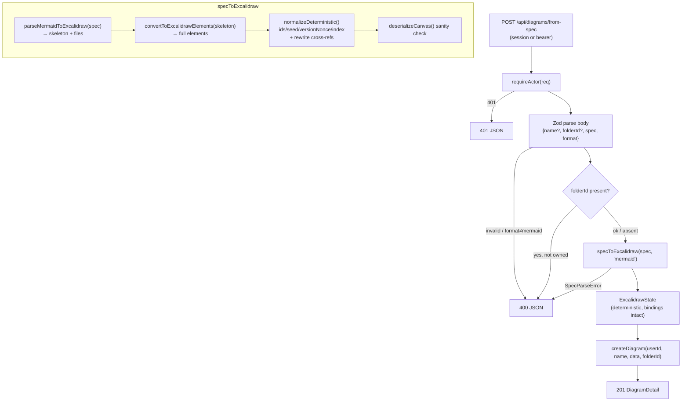

# Generation Layer (spec → Excalidraw) Design

**Spec**: `.specs/features/m9-generation/spec.md`
**Context/Decisions**: `.specs/features/m9-generation/context.md`
**Status**: Draft

---

## Architecture Overview

M9 adds one endpoint and one library module. The endpoint is a thin HTTP shell; all substance lives in
`lib/spec-to-excalidraw.ts`, which turns a Mermaid string into a valid, deterministic `ExcalidrawState`.
The route then reuses the existing `createDiagram` to persist — so M9 inherits ownership, actor auth
(M8), default-naming, and the `DiagramDetail` contract for free.

The conversion module is a **runtime adapter** (context.md D1): its public surface is a single async
function `specToExcalidraw(spec, format)`. Internally it hosts the two upstream calls in a headless
environment (jsdom shim by default; headless Chromium fallback) and then applies a deterministic
normalization pass. Callers never see which runtime won.



---

## Code Reuse Analysis

### Existing Components to Leverage

| Component | Location | How to Use |
|---|---|---|
| `requireActor(req)` | `lib/auth.ts` | Session-or-bearer auth on the new route — verbatim, same as `/api/diagrams` |
| `createDiagram(userId, name?, data?)` | `lib/diagrams.ts` | Persist the converted state; **extend** with optional `folderId` (additive) |
| `deserializeCanvas(data)` | `lib/excalidraw.ts` | Post-conversion validity check; guarantees the persisted shape matches load path |
| `ExcalidrawState` type + `EMPTY_DIAGRAM` | `lib/excalidraw.ts` | Return type of `specToExcalidraw`; appState defaults |
| Zod `safeParse`→400 pattern | `app/api/diagrams/route.ts` | Body validation shape for `from-spec` |
| Bearer middleware allowance | `auth.config.ts` | Already lets bearer `/api/*` through — `from-spec` is covered, **no middleware change** |
| Owner-scoped folder lookup | `lib/folders.ts` (`listFolders` / owner-scoped query) | Validate `folderId` ownership before attach (D3) |
| CSPRNG-avoidance / determinism mindset | `lib/api-key.ts`, `lib/diagrams.ts` | Same discipline: no `Date.now()` in identity |

### Integration Points

| System | Integration Method |
|---|---|
| Diagram persistence | Reuse `createDiagram`; add optional `folderId` param |
| Actor auth (M8) | `requireActor(req)` in the route; bearer already allowed by middleware |
| Excalidraw load path | Output validated through `deserializeCanvas` so create-from-spec and normal load agree |
| Upstream conversion libs | New deps `@excalidraw/mermaid-to-excalidraw` (+ jsdom for the runtime shim, pending T1) |

---

## Components

### `lib/spec-to-excalidraw.ts` (new) — conversion + normalization

- **Purpose**: Turn a Mermaid spec into a deterministic, valid `ExcalidrawState`. The value core of M9.
- **Location**: `lib/spec-to-excalidraw.ts`
- **Interfaces**:
  - `type SupportedFormat = "mermaid"`
  - `class SpecParseError extends Error` — thrown on unsupported format, empty result, or upstream
    parse failure; carries a client-safe message (no stack leak).
  - `specToExcalidraw(spec: string, format: SupportedFormat): Promise<ExcalidrawState>` — orchestrates
    parse → convert → `normalizeDeterministic` → `deserializeCanvas` sanity check; throws `SpecParseError`
    on any failure. Wraps everything in the headless runtime (D1).
  - `normalizeDeterministic(elements): ExcalidrawElement[]` (internal, pure, unit-testable) — reassigns
    `id`/`seed`/`versionNonce`/`version`/`updated`/`index` deterministically and rewrites all cross-refs
    (`boundElements`, `startBinding`/`endBinding`, `groupIds`, `frameId`). See context.md D2.
- **Dependencies**: `@excalidraw/mermaid-to-excalidraw`, `@excalidraw/excalidraw` (`convertToExcalidrawElements`),
  the D1 runtime shim (jsdom or Chromium), `node:crypto` (deterministic hashing), `lib/excalidraw.ts`.
- **Reuses**: `ExcalidrawState`/`ExcalidrawElement` types, `deserializeCanvas`.
- **Runtime note (D1)**: the two upstream calls need a DOM. Default: a jsdom shim set up once per module
  load, with `getComputedTextLength`/`getBBox` stubbed by a deterministic width heuristic so text nodes
  get sane, reproducible sizes. If T1 shows jsdom insufficient, the same function body is swapped to a
  headless-Chromium implementation — interface unchanged.

### `createDiagram` extension (modify)

- **Purpose**: Allow create with an optional folder in one call.
- **Location**: `lib/diagrams.ts`
- **Interfaces**: `createDiagram(userId, name?, data?, folderId?: string | null)` — when `folderId` given,
  set it on the created row (owner scoping already implicit — the row is created for `userId`).
- **Dependencies**: `db`.
- **Reuses**: existing body; only the `data:` object gains `folderId`. Backward-compatible (param optional).

### `POST /api/diagrams/from-spec` (new route)

- **Purpose**: HTTP shell: auth → validate → (validate folder) → convert → persist.
- **Location**: `app/api/diagrams/from-spec/route.ts`
- **Interfaces**: `POST(req: NextRequest)`; body `{ name?: string, folderId?: string, spec: string, format: "mermaid" }`;
  responses `201 DiagramDetail` | `400` (bad body / bad format / unparseable / unowned folder / empty result)
  | `401`.
- **Dependencies**: `requireActor`, `specToExcalidraw`, `createDiagram`, folders-ownership lookup, `zod`.
- **Reuses**: `POST /api/diagrams` structure (try/catch actor → 401, Zod → 400, create → 201).
- **Auth**: bearer already allowed by the existing `authorized` middleware (path under `/api/`); no
  `auth.config.ts` change.

---

## Data Models

```typescript
// lib/spec-to-excalidraw.ts
export type SupportedFormat = "mermaid"

export class SpecParseError extends Error {
  constructor(message: string) { super(message); this.name = "SpecParseError" }
}

// Returns the existing ExcalidrawState shape from lib/excalidraw.ts:
//   { elements: ExcalidrawElement[], appState: Partial<AppState>, files: BinaryFiles }
export function specToExcalidraw(
  spec: string,
  format: SupportedFormat,
): Promise<ExcalidrawState>
```

```typescript
// app/api/diagrams/from-spec/route.ts
const FromSpecSchema = z.object({
  name: z.string().min(1).max(255).optional(),
  folderId: z.string().optional(),
  spec: z.string().min(1),
  format: z.literal("mermaid"),
})
```

**No Prisma change.** Reuses the `Diagram` model. `createDiagram` gains an optional `folderId` argument.

---

## Determinism Algorithm (context.md D2, GEN-08/10/11/12)

`normalizeDeterministic(elements)` — pure, unit-tested without a DOM:

1. Keep the skeleton/convert output order as the canonical ordinal.
2. For each element `e` at ordinal `i`: `key = sha256hex(type + round(x) + round(y) + round(w) + round(h) + text + i)`.
   - `id = key.slice(0, 16)`
   - `seed = intFromHash(key, offset 0)`, `versionNonce = intFromHash(key, offset 8)` (positive 31-bit ints)
   - `version = 1`, `updated = 0` (never `Date.now()`)
3. Build `oldId → newId`. Rewrite in a second pass: `boundElements[].id`, `startBinding.elementId`,
   `endBinding.elementId`, `groupIds[]`, `frameId`. Drop any binding whose target id is not in the map
   (defensive — should not happen; asserted in tests).
4. Assign `index` as strictly ascending fractional keys (`"a0","a1",…`) in ordinal order.

Guarantees: same spec → deep-equal elements (GEN-10); identity is content-derived, not time/RNG (GEN-11);
no dangling bindings (GEN-12); ascending index (GEN-08).

---

## Error Handling Strategy

| Error Scenario | Handling | Client Impact |
|---|---|---|
| No/invalid session & no valid bearer | `requireActor` throws → 401 | `401 { error: "Unauthorized" }` |
| Missing/empty `spec`, or `format` ≠ `"mermaid"` | Zod `safeParse` → 400 before conversion | `400` with field errors |
| Mermaid syntax invalid | upstream throws → caught → `SpecParseError` → 400 | `400 { error: <safe msg> }`, no row written |
| Spec parses to zero elements | `specToExcalidraw` throws `SpecParseError` (D5) | `400`, no row written |
| `folderId` not owned / not found | ownership check fails → 400 | `400 { error: "Folder not found" }`, no row |
| Runtime (DOM/metrics) failure | surfaced at T1 spike / deploy, not shipped as 500 | n/a (build-time gate) |
| `createDiagram` DB error | propagates → 500 (unchanged from other routes) | `500` (genuine server fault only) |

`SpecParseError` messages are curated (e.g. "Invalid Mermaid syntax") — the raw parser error/stack is
never returned to the client.

---

## Tech Decisions (non-obvious)

| Decision | Choice | Rationale |
|---|---|---|
| Conversion runtime | jsdom shim by default, headless Chromium fallback, behind one module | The libs need a DOM (context.md D1). Isolating the runtime means the spike outcome never ripples into route/test code. |
| Deterministic post-pass | Rehash identity after `convertToExcalidrawElements` | The upstream converter uses RNG + time for id/seed/versionNonce; overwriting them with content-derived values makes output reproducible and snapshot-testable (GEN-10/11). |
| Reuse `createDiagram` (not a new persist path) | Route calls the same lib fn | Inherits ownership, actor auth, default-name, `DiagramDetail` contract → zero duplication, zero drift from the normal create path. |
| `deserializeCanvas` sanity check inside the module | Run the load-path deserializer on output before returning | Guarantees create-from-spec produces exactly what the editor load path expects; catches a bad conversion at the source, not in the browser. |
| `format` as a required literal enum | `z.literal("mermaid")` | Forward-compatible with a future DSL/format without a breaking body change; unknown value fails fast (GEN-14). |
| Empty result → 400 | Treat zero elements as an error (D5) | Almost always an AI mistake; blank canvas already has `POST /api/diagrams`. |
| No middleware change | Rely on existing bearer `/api/*` allowance | `from-spec` is under `/api/`; M8 already lets bearer through. Less surface, no regression risk. |
| `folderId` ownership validated | Explicit owner check in the route (D3) | Machine-facing route; prevents cross-user folder attach that the current PUT path doesn't guard. |

---

## Tips / Notes for Implementation

- **Do T1 (the runtime spike) first and honestly.** Everything else assumes `specToExcalidraw` works
  headless. If jsdom can't measure text, stub `getComputedTextLength`/`getBBox` deterministically before
  reaching for Chromium — approximate sizes are fine; the goal is *valid & renderable*, not pixel-exact.
- `convertToExcalidrawElements` is imported from `@excalidraw/excalidraw` — verify it's importable in the
  chosen runtime without dragging in `window`-dependent React code (part of the T1 spike).
- Lock Mermaid `securityLevel: "strict"` (no click handlers/scripts) when initializing the parser
  (security note).
- Keep `normalizeDeterministic` a **pure function** taking/returning element arrays so it unit-tests with
  no DOM and no DB — this is where most of the correctness lives.
- Carry the `files` map from `parseMermaidToExcalidraw` straight into the returned `ExcalidrawState.files`
  (GEN-17) so text labels render.
- Follow the Knowledge Verification Chain before finalizing the upstream API usage: the two-step
  `parseMermaidToExcalidraw` → `convertToExcalidrawElements` contract is confirmed against Excalidraw docs
  (context.md D1 links); pin the dependency version and re-verify the signature at install time.
